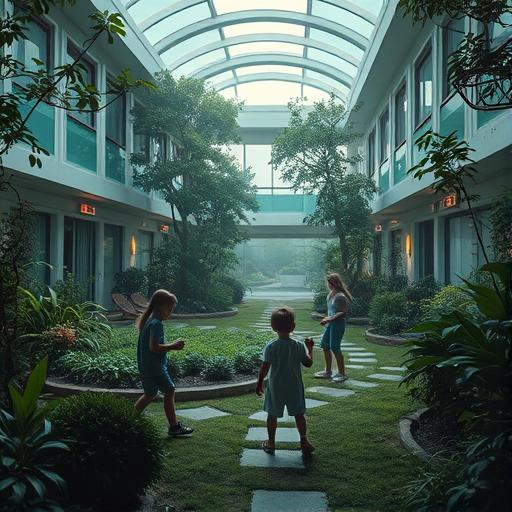
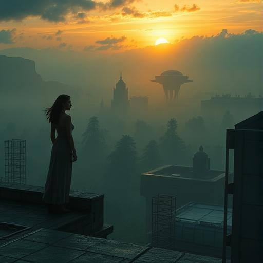

# Epilogue: A new dawn

## Ten years later {#-ten-years-later}

## Griffith Observatory, Los Angeles {#-los-angeles-3}

## October 6, 7:23 a.m. local time

Dr. Sarah Chen stood on the roof of the observatory and looked at a world that had changed beyond imagination.
imagination had changed.

The sky over Los Angeles was no longer empty. Soft, shimmering ships glided between the clouds - some as small as birds
some as small as birds, others as big as whales. Not all of them were from Earth. Some belonged to the Zephyrians with
with their crystalline hulls, others to the Lyralei with their flowing, waterdrop-shaped designs. Hundreds of species
had chosen to stay on Earth or visit regularly.

Earth had become the first interplanetary refuge in the galaxy.

"Morning, Dr. Chen," said a melodic voice behind her.

Sarah turned around and smiled. Zephyr materialized in his preferred humanoid form - tall, elegant,
with skin that sparkled like cut glass in the morning light.

"Morning, old friend. How's the center going?"

"Three new species arrived this week," Zephyr reported. "The Kelhari of Rigel VII - they are still very
traumatized by their time under Vak'tar control. But Miriam is working with them. She's making progress."

Sarah nodded. The Galactic Healing Center, which had been set up in the mountains above Los Angeles, treated hundreds of liberated beings every day.
hundreds of liberated beings every day. Miriam ran the psychology department with a dedication that amazed Sarah every day.
amazed anew every day.

"And the others?"

"Daryl is still in the Andromeda sector. He's helping to liberate the last Vak'tar enclaves. Aida is coordinating the
new galactic communications network from Sydney. Father Martinez..." Zephyr smiled, "is about to celebrate his sixth
interplanetary wedding this week."

Sarah laughed. "Some things never change."

They looked out over the city. Los Angeles had been transformed into an architectural wonder. Earthly buildings
now grew organically together with otherworldly structures. Gardens floated in the air, held in place by
Anari technology. Waterfalls flowed upwards. Crystal towers collected sunlight and dispersed it as soft
illumination in the night.

But the best thing was the people.

Children played with young aliens on playgrounds that treated gravity only as a suggestion. Artists created
works in four dimensions. Scientists solved problems that were centuries old.

Humanity was no longer alone in the universe. And it was better for it.

"Sarah," Zephyr turned serious, "there's news from Malgorth."

Sarah felt her attention sharpen. In the ten years since his conversion, the formerly evil
God-Emperor had traveled much of the galaxy trying to repair the damage he had done over millennia.
he had caused over millennia. It was a process that would take centuries.

"Good or bad?"

"That depends on your perspective. He has reached the last of the dead worlds - Kythara."

Sarah's breath caught. Kythara had been the original homeworld of the Anari before the Vak'tar had destroyed it.
Elyon had told her that it had become completely lifeless.

"So?"

"He resurrected her."

Silence.

"What do you mean by 'resurrected'?"

Zephyr projected a holographic image into the air between them. Sarah saw a planet that looked like a huge garden.
garden. Crystal cities that grew in harmonious spirals. Oceans that glowed in all colors of the spectrum.
colors of the spectrum. And life - life everywhere.

"Not just resurrected," Zephyr explained in an awed voice. "Enhanced. He has created a world that is
more beautiful than Kythara ever was. And he's invited everyone to come there. Humans, Anari, liberated Vak'tar, all
species of the galaxy. As a symbol... As a new beginning."

Sarah looked at the picture. It was breathtaking. But also...

"It's a trap," she said quietly.

"What?"

"No offense meant. But it's still a trap. Malgorth is still trying to control by giving. He has
just changed his methods."

Zephyr frowned - a strangely human gesture that he had adopted over the years. "Don't you think
that he really has changed?"

"Oh, he's changed. He's no longer a monster. But he's not... Free." Sarah sighed. "Real healing
takes time. For all of us."

As if her words had summoned him, a new presence appeared. Not physically, but Sarah felt it immediately - a
a huge, warm awareness that tapped respectfully at the edge of her thoughts.

*Sarah*, came Malgorth's voice, soft as a summer breeze. *May I speak with you?

"Always," she replied loudly.

A figure materialized in front of them - but not the huge, god-like form from before. Malgorth appeared
as a modest humanoid, no taller than a human, with eyes full of wisdom and... uncertainty.

"I heard what you said about me," he began, "about the trap."

Sarah blushed slightly. "I didn't mean to..."

"No, you were right." Malgorth sat down on a bench that spontaneously materialized out of light. "I am still creating
perfection and expect others to come to me. I still give in order to receive."

"That's human," Sarah said softly. "We all have our patterns."

"But I want to learn to be different. That's why I'm here." He looked at her with hopeful eyes. "Would you
help me? Not as goddess to god, but as... Friend to friend?"

Sarah sat down next to him. After ten years of cosmic responsibility, it was strangely comforting to just be two
beings trying to become better versions of themselves.

"What do you need?"

"Teach me how to... just be there. Without giving, without taking, without healing or controlling. Teach me,
how to simply... exist."

Sarah smiled. "That's actually the hardest thing of all."

They sat in comfortable silence for a while, watching the rising sun over a world that was still changing daily.
still changing daily. Somewhere in the distance they heard children's laughter - human and alien voices sounding in
perfect harmony.

"Sarah," Malgorth finally asked, "do you ever think about how differently things could have gone? If you had given up then,
that first night, had you given up?"

"Every day," she replied honestly. "But then I think about how every decision has led us to this moment.
has led us to this moment. And I can't think of a better moment."

"Even with all the challenges? The new problems we have created?"

Sarah looked out over a world where humans and aliens worked together to solve problems that would have been unimaginable ten years ago.
ten years ago would have been unimaginable. Where children grew up knowing that the universe was full of friends,
not full of enemies. Where hope was not just a feeling, but an experienced reality.

"Especially with the challenges," she said. "Perfection is boring. Growth is interesting."

Malgorth laughed - a sound like wind chimes in a gentle breeze. "You've taught me so much, little
teacher."

"We taught each other a lot."

Zephyr, who had been listening quietly, stepped closer. "The new shipload of refugees from the Vega system will be arriving in
one hour. Are you ready?"

Sarah and Malgorth got up. Every day brought new challenges, new opportunities to help, new chances to grow.
opportunities to grow.

"We're ready," they said simultaneously, then laughed at the synchronicity.

As they walked to the landing site, Sarah thought back to the words she had said to Malgorth ten years ago:
*It's never too late for redemption. It's never too late to choose who you want to be.

As it turned out, this didn't just apply to ancient alien gods. It applied to everyone.

The future was uncertain, full of new challenges and unexpected twists and turns. But for the first time in the
history of the galaxy, she was not alone. Billions of species, united not by conquest or control,
but by something far more powerful.

The choice to be there for each other.

And Sarah Chen, former neurologist from San Francisco, current Humanity Ambassador to the Galactic Healing Coalition, smiled and knew that the best was yet to come.
Healing Coalition, smiled, knowing that the best was yet to come.

The stars were waiting. And this time they went to them together.

---

## Andromeda sector {#-andromeda-sector}

## Spaceship "Hope"

## At the same time

Officer Daryl Mensah gazed through his ship's observation window at a world that had just awakened from a centuries-long nightmare.
centuries-long nightmare.

Planet Xerion had once been home to a thriving civilization of insectoid engineers. Then came the Vak'tar. For
three hundred years it had been a dead world.

Now she was humming with life again.

"Status report," he asked his Anari co-pilot, Lysander.

"The last parasite nests have been eliminated. The original inhabitants are awakening. First contacts are... emotional."

Daryl nodded. He had experienced it dozens of times. The moment when a species realized it was free. That
that the control they had thought was normal was gone. That they could be themselves again.

It was the reason why he got up every morning.

"How many worlds do we have left?"

"In the Andromeda sector? Twenty-seven. In the entire galaxy..." Lysander paused. "Two thousand, at a guess."

Daryl grinned. "Then we've still got a while to go."

"Doesn't that bother you? The distance from the earth? From the others?"

"I'm where I'm needed," Daryl replied simply. "That's always been my job."

He thought back to his time as a policeman, how long ago that seemed. Back then, he had thought his job was to make the streets
safe. Now he was making the galaxy safe.

Some things changed. Others stayed the same.

"Lysander, set course for the next system. The Korvani of Tau Ceti are waiting for liberation."

"Aye, Commander."

As the ship jumped through hyperspace, Daryl thought of Sarah and the others. They might be light years away,
but they were still a team.

Still a family.

---

## Sydney, Australia {#-sydney-1}

## Galactic Communication Center

## 14:47 local time

Aida Ramić typed at the speed of light while streams of data from ten thousand worlds flowed through her consciousness.
flowed through her consciousness.

The Galactic Network was their masterpiece - a communication system that connected every species, every technology, every type of consciousness.
types of consciousness with each other. Telepathic aliens could talk to digital life forms. Gaseous
intelligence could chat with crystalline hive minds.

It was complicated. It was chaotic. It was beautiful.

"Aida," came a voice over the intercom, "we have a priority message from the Andromeda Liberation Fleet."

"On the main screen."

Daryl's face appeared in a holographic projection. Older, wiser, but still the firm, reliable anchor they all needed.
they all needed.

"Aida, we have a problem. The Korvani have a technology I've never seen before. Quantum consciousness or
something like that. Can you help me with it?"

Aida grinned. After ten years, the team was still the team.

"Send me the data. I'll take a look at it."

As the information streamed through the network, Aida thought about how lonely she used to feel. A
hacker in a small apartment in Sarajevo who believed the world was a cold, hostile place.

Now she was connected to billions of consciousnesses. And instead of feeling lost, she had finally found her
found her home.

The galaxy was big. But it was also full of friends.

---

## Rome, Italy {#-rom-1}

## Basilica of St. Peter

## 19:33 local time

Father Ignacio Martinez knelt at the altar and prayed while one of the strangest weddings ever celebrated took place around him,
ever celebrated.

The groom was a crystalline being of light from the Sirius system. The bride was an amphibious philosopher from the oceans of
oceans of Kepler-442b. The guests were a mixture of humans, Anari and dozens of other species.

Love, Ignacio had learned, was truly universal.

"Speak your vows now," he said in Galactic Standard, a language that worked through colors and sounds.
worked through colors and sounds.

As the two beings exchanged their promises - one in light signals, the other in harmonic frequencies - Ignacio
Ignacio felt the same awe that he felt at every wedding ceremony.

God spoke in many languages. And love was the most universal of all.

After the ceremony, when the guests were celebrating and the different species were sharing their traditions, a young
half human, half Zephyrian, one of the first interplanetary children.

"Father Martinez," she asked in a voice like wind chimes, "do you think God is proud of us?"

Ignacio looked around him - at humans and aliens dancing together, laughing, sharing stories. To a galaxy,
that had learned to celebrate its differences instead of fearing them.

"I think," he said with a smile, "he's thrilled."

---

## Brno, Czech Republic {#-brno-2}

## Galactic Healing Center for Trauma

## 22:15 local time

Miriam Košová was sitting with a little Kelhari child who had not spoken a word since his liberation.

The Kelhari were one of the species that had been under Vak'tar control the longest. Five hundred years of
enslavement had left deep scars.

"It's all right," Miriam said softly, her words translated telepathically. "You don't have to speak. I'm
just here."

The child - Xen was his name - looked at her with large, dark eyes. Slowly, it stretched out a trembling hand.

Miriam took her carefully. Her touch made her feel everything - the fear, the pain, the confusion. But also
something else.

Hope.

"I... I remember my mother," Xen finally whispered. "She told me stories. About life
before... Before the Dark Ones."

"Would you like to tell me one of them?"

Xen smiled for the first time.

Later, as Miriam walked through the corridors of the center, she thought back to the children she had tried to protect ten years ago.
had tried to protect ten years ago. Many of them were now working here, helping to heal others.

Pain, she had learned, could become wisdom. Trauma could become compassion.

And love was always stronger than fear.

---

## Somewhere among the stars {#-somewhere}

## On board the "Eternal Hope"

## Time is relative

Elyon floated in his meditation room and watched the streams of data flowing to him from a thousand worlds.

The galaxy healed. Slowly, sometimes painfully, but steadily.

It wasn't perfect. It would never be perfect. There were still conflicts, misunderstandings, problems. But now
there was something else too:

The willingness to work together to solve them.

*Old friend*, came a familiar voice. Malgorth materialized next to him, unassuming and peaceful.

*Malgorth. How is your... therapy?

*Sarah is a strict teacher. She makes me confront my arrogance every day.* Malgorth laughed. *It
is... humiliating. And wonderful.

*And Kythara?

*Will be a gift. No bait, no price for worship. Simply a gift. For everyone who wants to come. Or
do not want to come. Sarah insists that freedom also means being able to say no.*

Elyon nodded sagely. *The humans have taught us a lot.

*They have shown us that strength lies not in the power to control others, but in the decision to serve them,
to serve them*.

The two ancient beings floated together in comfortable silence, contemplating a galaxy that was slowly learning to
to be a family.

---

## Griffith Observatory, Los Angeles {#-the-new-morning}

## The next morning, 6:00 a.m.

Sarah Chen stood on the roof again and looked up at the stars.

But this time she was not alone.

Around them stood dozens of others - humans and aliens, scientists and artists, children and elders. All of them
had come to do what had become a new tradition:

To share the dawn with those who loved her.

"Ready for another day?" asked Mrs. Patterson, who was now ninety and still came in every morning.

"Ready," Sarah replied.

Zephyr approached her. "The Korvani have been freed. Daryl is on his way to the next system. Aida has developed a new
communication protocol. Father Martinez performed seven weddings yesterday. Miriam has a
a breakthrough with the Kelhari children."

"And Malgorth?"

"Still learning to be simple."

Sarah smiled. "Like all of us."

The sun rose over a world that was no longer the same as it was ten years ago. Not perfect, but better. Not
without problems, but with hope.

And somewhere between the stars, new challenges, new opportunities, new friends were waiting.

The galaxy was big. But it was also full of wonders.

And the humans - this small, stubborn, wonderful species from a blue planet - had learned that they didn't have to be alone.
had to be alone.

No one had to be alone.

**END**

---

*"In a galaxy full of stars, the light of hope is the brightest of all. "*

**- From the Chronicles of the Galactic Healing Coalition**

---