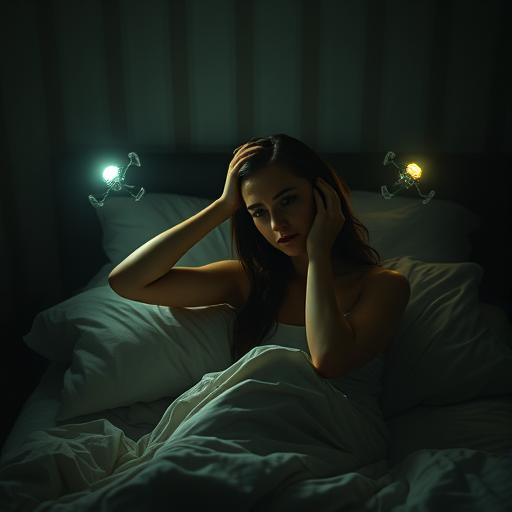

# The hunters and the hunted

## Chapter 1: Whispering in the dark {#chapter-1}

Dr. Sarah Chen awoke with a scream that never left her lips.

3:17 am. The digital display of her alarm clock beamed at her through the darkness of her bedroom like a red
reproach. Beads of sweat trickled down her forehead, even though the November air streamed coldly through the tilted window.

Something was different. Wrong.

She lay completely still and listened into the silence. Her neurologist's brain worked automatically: pulse increased, breathing
shallow, adrenaline rush with no recognizable trigger. A nightmare? No. She didn't remember any dreams.

Then she heard it.

A humming sound. So quiet that she wondered if it was real at all. Like the humming of old power lines or the
the distant roar of a highway. But more metallic. More vivid.

*Hungry.

Sarah slowly sat up and felt for the light switch. The dim light from the bedside lamp chased away the shadows
shadows, but not the unease that spread through her veins like ice water.

The buzzing had disappeared.

She got up and went to the window. The street was deserted, the lanterns cast yellow cones on the wet asphalt.
Everything was normal. Everything was quiet.

Too quiet.

Where were the cats that usually sneaked through the gardens at this time of day? Where was the barking of Mr. Kowalski's dog, who
barked at every night walker? The silence was not just the absence of sound - it was *absolute*. As if
someone had muted the world.

Sarah put on her robe and crept to the kitchen. A glass of warm milk, maybe that would help. As she
pouring the milk into a saucepan, she noticed her trembling hands.

*Come on, Sarah*, she scolded herself. *You're a neurologist. You know panic attacks.

But this wasn't a panic attack. This was...

The buzzing was back.

This time it didn't come from outside. It came from her head.

Sarah froze, the pot of milk still in her hand. The sound pulsed behind her eyes, rhythmic like a second heartbeat.
heartbeat. Like a signal.

Like a language.

*At last*, whispered a voice in her head that was not her own. *A new host. And so... promising.

The milk pot slipped from her fingers and smashed on the kitchen floor. White splashes everywhere, shards like teeth in the
candlelight.

"What... Who...?" Sarah grabbed her head, pressing her palms against her temples. The buzzing grew louder,
drilled deeper into her consciousness.

*Don't be afraid*, the voice purred amusedly. *I'm here to... complete you*.

Sarah ran to the bathroom and stared at herself in the mirror. Her face was pale, her eyes wide with panic. But
there was something else. Her pupils - they were flickering. As if a faint light was pulsing behind them.

*You're a scientist*, the voice continued, and Sarah felt her thoughts organize themselves, even though she didn't want to.
didn't want to. *You will understand. We are the next stage of evolution. Not for us - for you.

"Out." Sarah narrowed her eyes and concentrated. "Get out of my head!"

*That's not how it works, love.* The voice sounded closer now, more intimate. *I'm already part of you. Look.

Without Sarah wanting it, her right hand lifted. She watched, fascinated and horrified, as her own fingers
spread apart and slowly clenched into a fist. Then they opened again.

Not their movement. Not their decision.

*Impressive, isn't it? Your neurological system is so... primitive. So easy to overwrite.

Sarah ran back into the bedroom and grabbed her cell phone. 911. She had to... She had to call someone. An
Ambulance. The police. Someone.

But her fingers dialed a different number.

"Hello?" A sleepy voice. Her neighbor, Mrs. Patterson.

"Mrs. Patterson," Sarah heard herself say, though she didn't speak the words. "Could you come over here? I've...
Something's happened to me."

*Perfect*, praised the voice. *You learn quickly.

"Sarah? It's the middle of the night, dear. Is everything all right?"

"Please," Sarah struggled to form her own words, "don't... don't... here..."

But her voice said: "I've fallen. I need help. The door is open."

Mrs. Patterson sighed, "I'll be right there."

The conversation ended. Sarah stared at the cell phone as if it were a snake.

*Why?* she managed to think.

*Because she trusts. Because she is weak. Because we need to spread out.* The voice sounded eager now. *Your planet
is so full of delicious little flesh creatures. So full of pain and fear. We will help you realize your potential.
unfold.*

Sarah heard footsteps outside the front door. Mrs. Patterson, the 78-year-old widow next door who baked cookies every Sunday
and had three cats.

*No.* Sarah threw herself against the bedroom door and turned the key. *I won't let you hurt her.
hurt her.

*The voice laughed, a sound like shattering glass. *You still don't understand who's in control here.
control here.

Sarah's body moved against her will. Her legs carried her to the door, her hand turned the key back. She
fought against every movement, but it was as if she was fighting against steel.

"Sarah? I'm here!" Mrs. Patterson's voice from downstairs.

*The voice was now a command, cold as iron and irresistible. *Open the door. Invite her in.

Sarah walked down the stairs, each step a betrayal of her own will. She saw her hand move towards the door handle
towards the door handle, saw it move to open.

And then, in a last desperate surge of willpower, she screamed, "RUN! RUN AWAY!"

Silence.

*That*, the voice said softly, *was very unwise.

The pain came like a bolt of lightning. Sarah sank to her knees, her hands pressed to her head. It felt as if her brain was being
her brain was being pierced with red-hot needles.

"Sarah? What's going on in there?" Mrs. Patterson's worried voice. "I'm calling the police!"

*No*, the voice commanded, and the pain subsided. *You will tell her that everything is all right. You will
invite her in. And you will watch as we show her what pain really means.

Sarah stood up slowly. Her hand moved to the door handle.

But at that moment she heard something else. A different hum. Higher, clearer. And the voice in her head...
fell silent.

*What...?* A hint of confusion. For the first time, the thing in her head sounded uncertain.

The new humming grew louder. And with it came light - a soft, golden glow that fell through the window next to the door.
door.

Sarah turned around and looked outside.

Lights hovered in the sky. Hundreds of them. Like glowing snowflakes, moving in perfect patterns.
They pulsed to the rhythm of the new hum, as if they were talking to each other.

*No*, hissed the voice in her head, now panicked. *That's not possible. You shouldn't... you can't
not...*

The golden light became brighter. And suddenly Sarah felt something loosen in her head. As if a cage
opened.

She could think clearly again.

"Mrs. Patterson!" she called through the door. "Go home! Lock all the doors and windows! Don't trust
no one!"

"Sarah, what are you talking about? Let me in!"

"NO!" Sarah leaned against the door. "Look up at the sky! Do you see the lights? Something is happening. Something
Big."

She heard Mrs. Patterson's astonished murmur. "My God... what is that?"

*Come back*, the voice in Sarah's head whispered, but it sounded weaker now. *You're mine.

"No," Sarah said loudly. "I don't belong to anyone."

The golden light pulsed brightly once, and the voice fell completely silent.

Sarah sank against the door and stared out through the window at the dancing lights in the sky. Somewhere out there,
in the darkness, people were screaming. But here, in this moment, she was free.

The only question was: for how long?

And who were the new players in this cosmic chess game?

Sarah reached for her laptop. As a neurologist, she had to understand what was happening. As a human being, she had to
survive.

As if the fate of the world depended on it.

Which, as she would soon learn, was indeed the case.

---