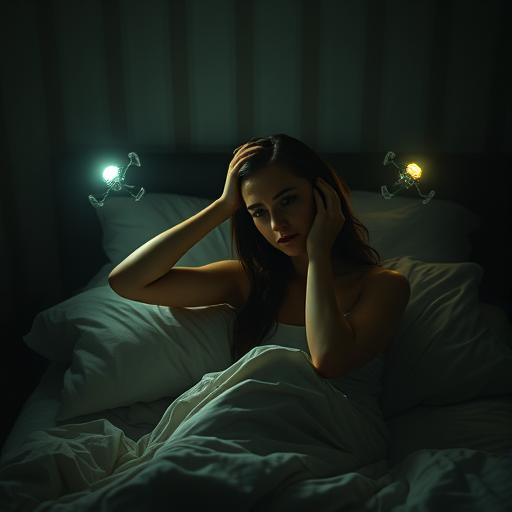

# Die Jäger und die Gejagten

## Kapitel 1: Das Flüstern im Dunkeln {#kapitel-1}

Dr. Sarah Chen erwachte mit einem Schrei, der nie ihre Lippen verließ.

3:17 Uhr. Die Digitalanzeige ihres Weckers strahlte sie durch die Dunkelheit ihres Schlafzimmers an wie ein roter
Vorwurf. Schweißperlen rannen über ihre Stirn, obwohl die Novemberluft kalt durch das gekippte Fenster strömte.

Etwas war anders. Falsch.

Sie lag völlig still und lauschte in die Stille hinein. Ihr Neurologen-Gehirn arbeitete automatisch: Puls erhöht, Atmung
flach, Adrenalin-Schub ohne erkennbaren Auslöser. Ein Alptraum? Nein. Sie erinnerte sich an keine Träume.

Dann hörte sie es.

Ein Summen. So leise, dass sie sich fragte, ob es überhaupt real war. Wie das Brummen alter Stromleitungen oder das
ferne Rauschen einer Autobahn. Aber metallischer. Lebendiger.

*Hungriger.*

Sarah richtete sich langsam auf und tastete nach dem Lichtschalter. Das schwache Licht der Nachttischlampe vertrieb die
Schatten, aber nicht das Unbehagen, das sich wie Eiswasser in ihren Adern ausbreitete.

Das Summen war verschwunden.

Sie stand auf und ging zum Fenster. Die Straße lag verlassen da, die Laternen warfen gelbe Kegel auf den nassen Asphalt.
Alles normal. Alles ruhig.

Zu ruhig.

Wo waren die Katzen, die sonst um diese Zeit durch die Gärten schlichen? Wo das Bellen von Herrn Kowalskis Hund, der
jeden Nachtwanderer verbellte? Die Stille war nicht nur die Abwesenheit von Geräuschen – sie war *absolut*. Als hätte
jemand die Welt auf stumm geschaltet.

Sarah zog ihren Morgenmantel über und schlich zur Küche. Ein Glas warme Milch, vielleicht würde das helfen. Während sie
die Milch in einen Topf goss, bemerkte sie ihre zitternden Hände.

*Komm schon, Sarah*, schalt sie sich selbst. *Du bist Neurologin. Du kennst Panikattacken.*

Aber das hier war keine Panikattacke. Das hier war...

Das Summen war zurück.

Diesmal kam es nicht von draußen. Es kam aus ihrem Kopf.

Sarah erstarrte, der Milchtopf noch in der Hand. Das Geräusch pulsierte hinter ihren Augen, rhythmisch wie ein zweiter
Herzschlag. Wie ein Signal.

Wie eine Sprache.

*Endlich*, flüsterte eine Stimme in ihrem Kopf, die nicht ihre eigene war. *Ein neuer Wirt. Und so... vielversprechend.*

Der Milchtopf entglitt ihren Fingern und zerschellte auf dem Küchenboden. Weiße Spritzer überall, Scherben wie Zähne im
Kerzenlicht.

"Was... wer...?" Sarah griff sich an den Kopf, drückte ihre Handflächen gegen die Schläfen. Das Summen wurde lauter,
bohrte sich tiefer in ihr Bewusstsein.

*Hab keine Angst*, schnurrte die Stimme amüsiert. *Ich bin hier, um dich zu... vervollständigen.*

Sarah rannte zum Badezimmer und starrte sich im Spiegel an. Ihr Gesicht war bleich, die Augen geweitet vor Panik. Aber
da war noch etwas anderes. Ihre Pupillen – sie flackerten. Als würde ein schwaches Licht dahinter pulsieren.

*Du bist Wissenschaftlerin*, fuhr die Stimme fort, und Sarah spürte, wie sich ihre Gedanken ordneten, obwohl sie es
nicht wollte. *Du wirst verstehen. Wir sind die nächste Evolutionsstufe. Nicht für uns – für euch.*

"Raus." Sarah kniff die Augen zusammen und konzentrierte sich. "Raus aus meinem Kopf!"

*So funktioniert das nicht, Liebes.* Die Stimme klang jetzt näher, intimer. *Ich bin bereits Teil von dir. Sieh.*

Ohne dass Sarah es wollte, hob sich ihre rechte Hand. Sie beobachtete fasziniert und entsetzt, wie ihre eigenen Finger
sich spreizten und langsam zur Faust ballten. Dann öffneten sie sich wieder.

Nicht ihre Bewegung. Nicht ihre Entscheidung.

*Beeindruckend, nicht wahr? Euer neurologisches System ist so... primitiv. So leicht zu überschreiben.*

Sarah rannte zurück ins Schlafzimmer und griff nach ihrem Handy. 911. Sie musste... sie musste jemanden anrufen. Einen
Krankenwagen. Die Polizei. Irgendwen.

Aber ihre Finger wählten eine andere Nummer.

"Hallo?" Eine verschlafene Stimme. Ihre Nachbarin, Mrs. Patterson.

"Mrs. Patterson", hörte Sarah sich sagen, obwohl sie die Worte nicht sprach. "Könnten Sie mal rüberkommen? Mir ist...
mir ist etwas passiert."

*Perfekt*, lobte die Stimme. *Du lernst schnell.*

"Sarah? Es ist mitten in der Nacht, Liebes. Ist alles in Ordnung?"

"Bitte," Sarah kämpfte darum, ihre eigenen Worte zu formen, "kommen Sie... nicht... hier..."

Aber ihre Stimme sagte: "Ich bin gestürzt. Ich brauche Hilfe. Die Tür ist offen."

Mrs. Patterson seufzte. "Ich komme sofort."

Das Gespräch endete. Sarah starrte das Handy an, als wäre es eine Schlange.

*Warum?* schaffte sie es zu denken.

*Weil sie vertraut. Weil sie schwach ist. Weil wir uns ausbreiten müssen.* Die Stimme klang jetzt begierig. *Euer Planet
ist so voller köstlicher kleiner Fleischwesen. So voller Schmerz und Angst. Wir werden euch helfen, euer Potenzial zu
entfalten.*

Sarah hörte Schritte vor der Haustür. Mrs. Patterson, die 78-jährige Witwe von nebenan, die jeden Sonntag Kekse backte
und drei Katzen hatte.

*Nein.* Sarah warf sich gegen die Schlafzimmertür und drehte den Schlüssel um. *Ich lasse nicht zu, dass du ihr
wehtust.*

*Du lässt zu?* Die Stimme lachte, ein Geräusch wie zersplitterndes Glas. *Du verstehst noch nicht, wer hier die
Kontrolle hat.*

Sarahs Körper bewegte sich gegen ihren Willen. Ihre Beine trugen sie zur Tür, ihre Hand drehte den Schlüssel zurück. Sie
kämpfte gegen jede Bewegung, aber es war, als würde sie gegen Stahl ankämpfen.

"Sarah? Ich bin da!" Mrs. Pattersons Stimme von unten.

*Geh.* Die Stimme war jetzt ein Befehl, eisenkalt und unwiderstehlich. *Öffne die Tür. Lade sie herein.*

Sarah ging die Treppe hinunter, jeder Schritt ein Verrat an ihrem eigenen Willen. Sie sah ihre Hand auf die Türklinke
zugehen, sah, wie sie sich bewegte, um zu öffnen.

Und dann, in einem letzten verzweifelten Aufbäumen ihrer Willenskraft, schrie sie: "LAUFEN SIE! LAUFEN SIE WEG!"

Stille.

*Das*, sagte die Stimme leise, *war sehr unklug.*

Der Schmerz kam wie ein Blitz. Sarah sank auf die Knie, ihre Hände an den Kopf gepresst. Es fühlte sich an, als würde
ihr Gehirn mit glühenden Nadeln durchstochen.

"Sarah? Was ist los da drin?" Mrs. Pattersons besorgte Stimme. "Ich rufe die Polizei!"

*Nein*, befahl die Stimme, und der Schmerz ließ nach. *Du wirst ihr sagen, dass alles in Ordnung ist. Du wirst sie
hereinbitten. Und du wirst zusehen, wie wir ihr zeigen, was Schmerz wirklich bedeutet.*

Sarah stand langsam auf. Ihre Hand bewegte sich zur Türklinke.

Aber in diesem Moment hörte sie etwas anderes. Ein anderes Summen. Höher, klarer. Und die Stimme in ihrem Kopf...
verstummte.

*Was...?* Ein Hauch von Verwirrung. Zum ersten Mal klang das Ding in ihrem Kopf unsicher.

Das neue Summen wurde lauter. Und mit ihm kam Licht – ein sanftes, goldenes Leuchten, das durch das Fenster neben der
Tür fiel.

Sarah drehte sich um und sah hinaus.

Am Himmel schwebten Lichter. Hunderte von ihnen. Wie leuchtende Schneeflocken, die sich in perfekten Mustern bewegten.
Sie pulstierten im Rhythmus des neuen Summens, als würden sie miteinander sprechen.

*Nein*, zischte die Stimme in ihrem Kopf, jetzt panisch. *Das ist nicht möglich. Sie sollten nicht... sie können
nicht...*

Das goldene Licht wurde heller. Und plötzlich spürte Sarah, wie sich etwas in ihrem Kopf löste. Als würde ein Käfig
geöffnet.

Sie konnte wieder klar denken.

"Mrs. Patterson!" rief sie durch die Tür. "Gehen Sie nach Hause! Schließen Sie alle Türen und Fenster ab! Vertrauen Sie
niemandem!"

"Sarah, was redest du da? Lass mich rein!"

"NEIN!" Sarah lehnte sich gegen die Tür. "Schauen Sie in den Himmel! Sehen Sie die Lichter? Irgendetwas passiert. Etwas
Großes."

Sie hörte Mrs. Pattersons erstaunte Laute. "Mein Gott... was ist das?"

*Komm zurück*, wisperte die Stimme in Sarahs Kopf, aber sie klang schwächer jetzt. *Du gehörst mir.*

"Nein", sagte Sarah laut. "Ich gehöre niemandem."

Das goldene Licht pulsierte einmal hell auf, und die Stimme verstummte völlig.

Sarah sank gegen die Tür und starrte durch das Fenster hinaus auf die tanzenden Lichter am Himmel. Irgendwo da draußen,
in der Dunkelheit, schrien Menschen. Aber hier, in diesem Moment, war sie frei.

Die Frage war nur: Für wie lange?

Und wer waren die neuen Spieler in diesem kosmischen Schachspiel?

Sarah griff nach ihrem Laptop. Als Neurologin musste sie verstehen, was gerade passierte. Als Mensch musste sie
überleben.

Als ob das Schicksal der Welt davon abhinge.

Was, wie sie bald erfahren würde, tatsächlich der Fall war.

---
