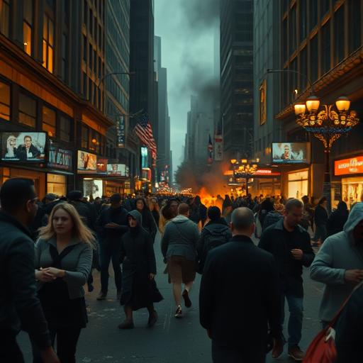

# Chapter 2: The First Night {#chapter-2}

## Sarajevo, Bosnia-Herzegovina

## 3:42 a.m. local time {#-sarajevo-1}

Aida Ramić jolted upright as her laptop screen flared to life.

Not literally. But the flood of data racing across her monitor may as well have been fire.  
Hundreds of network anomalies. Communication spikes. Encrypted signals. All at once. All without explanation.

"Šta se dešava?" she mumbled, rubbing her eyes. Her fingers flew across the keyboard, launching commands she knew by
heart.  
Aida was one of the best hackers in Eastern Europe — not that anyone was supposed to know.

None of it made sense.  
Satellite feeds from across the globe showed the same phenomenon: sudden spikes in activity at exactly 3:00 a.m. local
time.  
London. New York. Tokyo. Sydney. As if the whole planet had collectively held its breath.

Then the live streams started.

She opened a dozen windows at once — news feeds, social media, hacked security cams.  
What she saw froze her blood.

People. In the streets.  
But something about the way they moved was… wrong.

In Manchester, a woman in a nightgown wandered the main road with a kitchen knife in her hand.  
In Seoul, a man hurled Molotov cocktails into his neighbors’ windows.  
In Rio, an entire family smashed cars in their street — methodically, almost calmly.

All with the same blank stare. The same vacant expression.

"No, no, no..." Aida typed feverishly, trying to identify a common cause.  
A virus? Mass hypnosis? Neurotoxins?

Then came the knock at her door.

Aida lived alone in a cramped fourth-floor apartment in a war-weathered building.  
No one visited her. Especially not at this hour.

The knock came again — steady, rhythmic, patient.

She crept toward the door and looked through the peephole.

Mr. Martinović, her neighbor. A retired teacher. Quiet. Polite. Always kept to himself.

But his face...

That same empty stare.

“Aida,” he said — in his voice, but not his voice. “Open the door. We need to talk.”

Aida backed away.  
Her laptop chimed with a new alert. Reports were pouring in: massacres in hospitals. Pilots crashing their own planes.
Soldiers turning on their comrades.

Everywhere.  
All at once.

“Aida.” His voice again — closer now, just on the other side. “You can’t stay in there forever.  
We know you’re inside.”

_We?_

She ran to the window.

Down on the street, dozens of people were staring up at her window.  
All with that same, dead gaze.

Her phone rang. Unknown number.

“Hello?” she whispered.

“Aida Ramić,” said an unfamiliar voice — American accent. “Listen carefully. Don’t ask questions.  
Grab your laptop and leave the building. Now.”

“Who are you? How did you—”

“The roof. There’s a fire escape in the back. Move. Now.”

Click.

The line went dead.

---

## Los Angeles, USA {#-los-angeles-1}

## 6:58 a.m. local time

Officer Daryl Mensah stared at his partner’s body, wondering why his hand wouldn’t stop trembling.

Jenny Martinez lay in a pool of blood outside the 24-hour gas station they’d pulled into for a routine call.  
Three shots to the chest. Precise. Efficient.

Daryl had fired them.

But Jenny had shot first.  
At the child.

“Dispatch, we need... we need everything,” he said hoarsely into the radio. “Officer down. Civilian down. Suspect...”  
He paused. “Suspect neutralized.”

How do you explain that the suspect was your own partner?

It began around 3 a.m.  
Domestic disturbance in apartment 12B. Standard response. They knocked.

Mrs. Chen — a neurologist Daryl had once pulled over for speeding — had called for help.

But the moment the door opened, Jenny lost it.

“You see it too, don’t you?” she whispered, aiming her gun at Mrs. Chen. “That thing in her head. It’s moving.”

“Jenny, drop the weapon!”

“They’re infected, Daryl. All of them. Can’t you see it?” Her pupils were pinpoints. Her voice brittle.  
“They’ve got something inside. Something _hungry_.”

Mrs. Chen tried to explain — it was just a bad dream, she was fine.

Jenny didn’t listen.

She pulled the trigger.

And Daryl had no choice.

Now he knelt beside Mrs. Chen. She was wounded, but alive.  
“It’s okay,” he murmured, pressing a towel against her shoulder. “You’re going to be okay.”

“Officer...” she reached for his arm, eyes wide and lucid. “Your partner... she wasn’t herself, was she?”

Daryl froze. “What do you mean?”

“Her eyes. Did you see them flicker?”

He had.  
Jenny’s eyes had pulsed — as if something dim and alien was glowing behind them.

“It wasn’t her fault,” Mrs. Chen whispered. “She wasn’t herself anymore. None of them are.”

“None of who?”

She pointed weakly to the window.

Outside, people stood in the street. Dozens of them.  
All looking up at the apartment.  
All with that same flickering glow in their eyes.

Daryl’s radio crackled to life:  
“All units, multiple incidents citywide. Repeat: Officers attacking civilians. Civilians attacking officers. All
available units—”

The voice cut out.  
Silence.  
Then: “Help. They’re here. They’re all here. They’re staring at me and I can’t— I can’t—”

Silence again.

Daryl checked his weapon. Full magazine.  
But how many shots would he need?  
And who — or what — would he be shooting?

Mrs. Chen tugged on his sleeve. “The lights,” she gasped. “Did you see the golden lights?”

He had.  
Points of light in the sky, drifting like living stars.

“What are they?”

“I don’t know,” she said softly. “But I think... I think they’re here to help.”

---

## Brno, Czech Republic {#-brno-1}

## 12:34 p.m. local time

Miriam Košová huddled in the school library with thirteen children, praying the barricade would hold.

Outside, footsteps echoed down the hallway. Slow. Measured.  
Her colleagues — searching room by room.

It had started during second period.  
Miriam had been teaching history — the Velvet Revolution, hope, change — when Mr. Novák, the math teacher, burst in.

Without a word, he grabbed Anna, a ten-year-old girl in the front row, and threw her against the wall.

“Mr. Novák!” Miriam jumped up. “What are you doing?!”

He turned to her with eyes that didn’t belong to him. Flickering like faulty lights.  
Then he smiled.

“Lessons,” he said. “I’m teaching them what pain means.”

She hit the emergency alarm.  
But the emergency never came.

More teachers arrived instead.  
All with flickering eyes. All with hungry smiles.

She gathered as many kids as she could and fled to the library.  
Books as walls. Knowledge as shield.

But it wouldn’t be enough.

“Miss Košová,” whispered Tomáš, a wide-eyed eight-year-old. “Why are the teachers being so mean?”

She crouched beside him.  
How do you explain to a child that the world has gone mad?

“Sometimes,” she said gently, “people get sick. Not in here—” she pointed to his chest “—but here.” She tapped her
forehead.

“Can they get better?”

She glanced toward the window.

Golden lights drifted across the sky — moving in patterns that looked almost like language.

“I think so,” she whispered, hoping it was true.

The footsteps stopped.

“Miriam,” called a familiar voice — Principal Dvořáková. “We know you’re in there. With the children.”

Miriam motioned for silence.

“You can’t protect them forever,” the voice continued. “They must learn. We all must learn what we really are.”

A knock at the door.  
Then scratching.  
Fingernails on wood.

“Humans are so fragile,” the principal whispered. “So full of useless emotions. Love. Hope. Compassion.  
We can help them let go.”

Miriam held the children close.  
Thirteen small souls.  
Thirteen reasons not to give up.

The scratching grew louder.

And then — silence.

“What...?” The principal’s voice quivered. “No. That’s not possible.”

Miriam heard footsteps. Retreating. Running.

She crept to the window.

The golden lights were brighter now.  
On the schoolyard below, teachers and staff stood blinking, confused — as if waking from a dream.

“Miss Košová?” Tomáš tugged her sleeve. “Are the mean teachers nice again?”

She watched as Mr. Novák buried his face in his hands and wept.  
As the principal dropped to her knees and screamed.

“I think,” Miriam said slowly, “someone is helping them.”

But who?

And for how long?

And what would it cost?

The golden lights pulsed once —  
and Miriam knew:  
Everything was about to change.

She just didn’t know…  
whether it was for better — or for worse.

---