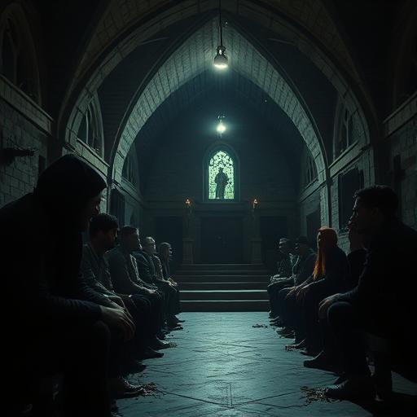

# Kapitel 3: Erste Kontakte  {#kapitel-3}

## San Francisco, USA  {#-san-francisco-1}

## 4:47 Uhr Ortszeit

Father Ignacio Martinez kniete zwischen den Leichen von sechzehn Gemeindemitgliedern und betete zu einem Gott, der heute
Nacht sehr weit weg zu sein schien.

Sie waren in die Kirche gekommen, als die Gewalt begann. Suchende, Verlorene, Familien mit Kindern – alle baten um
Schutz vor dem Wahnsinn, der die Straßen erfasst hatte. Ignacio hatte die Türen geöffnet, wie er es immer getan hatte.

Er hatte nicht gewusst, dass einige von ihnen bereits... verändert waren.

Mrs. Delgado war die erste gewesen. Eine 67-jährige Großmutter, die jeden Sonntag in der ersten Reihe saß und Kekse für
den Gemeindekaffee backte. Sie hatte ein Messer aus ihrer Handtasche gezogen und war auf die Familie neben ihr
losgegangen.

Dann war es eine Kettenreaktion geworden.

Ignacio hatte versucht zu helfen, hatte versucht zu verstehen. Aber als er in Mrs. Delgados Augen blickte – die
flackernden, unmenschlichen Augen – hatte er gewusst, dass das nicht mehr die Frau war, die er taufte, traute und
begrub.

"Padre," krächzte eine schwache Stimme.

Ignacio drehte sich um. Miguel Santos, ein vierzehnjähriger Junge, lag hinter dem Altar. Drei tiefe Kratzer zogen sich
über seine Brust, aber er atmete noch.

"Miguel." Ignacio eilte zu ihm. "Hab keine Angst. Du bist in Sicherheit."

"Nein," flüsterte der Junge. "Niemand ist sicher. Sie... sie sind in unseren Köpfen, Padre. Ich kann sie hören.
Flüstern."

Ignacios Blut gefror. "Was flüstern sie?"

"Dass... dass Gott tot ist. Dass es nur noch uns gibt. Und dass wir alle lernen müssen, was echte Macht bedeutet."

Miguel griff nach Ignacios Handgelenk. Seine Augen flackerten.

"Es tut mir leid, Padre."

Der Junge bewegte sich schneller, als ein Verwundeter sollte. Das Messer – Mrs. Delgados Messer – blitzte auf.

Ignacio rollte sich weg, das Messer verfehlte seinen Hals um Zentimeter. Miguel kam auf die Füße, bewegte sich ruckartig
wie eine kaputte Marionette.

"Miguel, das bist nicht du!" Ignacio wich zurück. "Kämpfe dagegen an!"

"Kämpfen?" Miguel lachte, aber es war nicht seine Stimme. "Warum sollte er kämpfen? Wir geben ihm Stärke. Klarheit.
Zweck."

"Du gibst ihm Tod."

"Wir geben ihm Evolution."

Miguel sprang vorwärts. Ignacio griff nach dem schweren Silberkreuz auf dem Altar und schwang es. Es traf den Jungen an
der Schläfe, und er ging zu Boden.

Für einen Moment waren Miguels Augen wieder normal. Verängstigt. Verwirrt.

"Padre? Was... was ist passiert? Warum tut alles so weh?"

Dann flackerten die Augen wieder, und Miguel grinste.

"Du kannst uns nicht alle töten, Priester. Wir sind bereits zu viele."

Ignacio hörte Schritte vor der Kirche. Viele Schritte.

Er rannte zum Fenster und blickte hinaus. Hunderte von Menschen strömten auf die Kirche zu. Alle mit dem gleichen
flackernden Blick. Alle mit dem gleichen hungrigen Lächeln.

"Mein Gott," flüsterte er.

"Gott," sagte Miguel, der wieder auf den Beinen war, "ist nicht hier."

Plötzlich explodierte Licht durch die Kirchenfenster. Nicht das warme Licht der Buntglasfenster, sondern etwas Kälteres,
Reineres. Goldenes Licht, das die gesamte Kirche erfüllte.

Miguel schrie auf und fiel wieder zu Boden. Seine Augen hörten auf zu flackern.

"Padre?" Seine Stimme war wieder die eines verängstigten Jungen. "Ich erinnere mich an alles. Oh Gott, was habe ich
getan?"

Ignacio half ihm auf die Füße. "Es warst nicht du, Sohn."

Draußen hörten sie Verwirrung. Schreie der Orientierungslosigkeit, nicht der Wut.

Ignacio öffnete vorsichtig die Kirchentür. Die Menschen, die noch vor Minuten wie ein Mob gewirkt hatten, standen jetzt
verwirrt umher. Viele weinten. Andere starrten ihre eigenen Hände an, als würden sie sie zum ersten Mal sehen.

Am Himmel tanzten die goldenen Lichter in Mustern, die fast wie... Sprache aussahen.

"Was sind sie?" flüsterte Miguel.

"Ich weiß es nicht," antwortete Ignacio. "Aber ich glaube, sie sind hier, um zu helfen."

Eines der Lichter schwebte näher. Es pulsierte, und Ignacio hörte... nicht hörte, sondern *verstand* eine Stimme:

*Friede sei mit dir, Hüter des Glaubens. Wir sind gekommen, um das Unrecht zu korrigieren.*

---

## Sarajevo, Bosnien-Herzegowina {#-sarajevo-2}

## 5:23 Uhr Ortszeit

Aida Ramić balancierte auf dem schmalen Fenstersims im sechsten Stock und fragte sich, ob Hacker-Skills beim Fallen
helfen würden.

Die Feuerleiter, die der mysteriöse Anrufer erwähnt hatte, war seit zehn Jahren verrostet. Drei Sprossen fehlten, und
der Rest sah aus, als würde er bei der ersten Berührung zusammenbrechen.

Unter ihr standen immer noch die besessenen Nachbarn. Sie schauten nicht mehr zu ihrem Fenster hinauf – sie warteten
einfach. Geduldig. Wie Spinnen in einem Netz.

Ihr Laptop war in einem wasserdichten Rucksack verstaut. Zwanzig Kilo beste Hacker-Hardware auf dem Rücken, während sie
versuchte, nicht abzustürzen.

*Genial, Aida*, dachte sie. *Du stirbst nicht durch Aliens, sondern durch Sturz.*

Ihr Handy vibrierte. Eine SMS von der unbekannten Nummer:

*Nordwestecke. Weißer Van. Jetzt bewegen.*

Aida blickte in die Richtung. Tatsächlich – ein weißer Lieferwagen mit laufendem Motor. Am Steuer eine Frau mit kurzen
grauen Haaren.

*Wer zum Teufel...*

Keine Zeit für Fragen. Die Menschen unten hatten begonnen, sich zu bewegen. Alle gleichzeitig, alle in Richtung des
Gebäudeeingangs.

Aida atmete tief durch und sprang.

Die Feuerleiter ächzte, hielt aber. Sprosse für Sprosse arbeitete sie sich nach unten, jede Bewegung ein kleines Wunder
des nicht-Sterbens.

Drei Meter über dem Boden brach die letzte Sprosse.

Sie fiel, landete hart auf dem Asphalt. Schmerz schoss durch ihr Handgelenk, aber nichts war gebrochen.

"Hier!" Die Frau im Van winkte sie heran.

Aida rannte. Hinter ihr hörte sie die mechanischen Schritte der Besessenen, die um das Gebäude liefen.

Sie sprang in den Van, die Frau gab Gas.

"Wer sind Sie?" keuchte Aida.

"Dr. Sarah Chen," antwortete die Frau, während sie durch die leeren Straßen raste. "Neurologin aus den USA. Und Sie sind
Aida Ramić, Hackerin und eine der wenigen Menschen auf diesem Planeten, die verstehen könnte, was gerade passiert."

"Woher wissen Sie—"

"Das erkläre ich später. Können Sie Ihre Computer hier zum Laufen bringen?" Sarah deutete auf eine Reihe von Laptops auf
dem Rücksitz.

Aida sah genauer hin. Militärische Hardware, Verschlüsselungssoftware, Satelliten-Uplinks. "Wer hat Ihnen das gegeben?"

"Die gleichen Leute, die mir Ihre Adresse gegeben haben." Sarah bog scharf rechts ab. "Die goldenen Lichter."

Als hätte sie ein Stichwort gegeben, leuchtete der Himmel über ihnen auf. Die Lichter formten sich zu Mustern, zu
Symbolen, fast wie...

"Koordinaten," flüsterte Aida. "Sie zeigen uns Koordinaten."

"Wohin?"

Aida tippte fieberhaft auf einem der Laptops. Die Symbole übersetzten sich in Zahlen, die Zahlen in Positionen. "Los
Angeles. Ein Parkplatz in der Nähe von... einer Polizeistation?"

Sarah lächelte grimm. "Dann treffen wir dort einen Polizisten."

---

## Los Angeles, USA {#-los-angeles-2}

## 7:15 Uhr Ortszeit

Daryl Mensah saß in seinem Streifenwagen und starrte auf das Funkgerät, das seit einer Stunde nur noch Stille sendete.

Mrs. Chen war in ein Krankenhaus gebracht worden – eines der wenigen, das noch funktionierte. Die meisten medizinischen
Einrichtungen waren... kompromittiert. Ärzte, die ihre Patienten töteten. Krankenschwestern, die Gift in die
IV-Leitungen spritzten.

Die Welt war verrückt geworden.

Daryl hatte versucht, zur Station zurückzufahren, aber die Zufahrt war blockiert. Nicht von Barrikaden – von Leichen.
Seine Kollegen hatten sich gegenseitig umgebracht.

Jetzt parkte er auf einem leeren Parkplatz und fragte sich, was ein Polizist macht, wenn es keine Polizei mehr gibt.

Sein Funkgerät knisterte plötzlich zum Leben:

"Officer Mensah? Hier ist Dr. Sarah Chen. Können Sie mich hören?"

Daryl griff nach dem Mikrofon. "Dr. Chen? Ich dachte, Sie wären im Krankenhaus."

"War ich. Aber die goldenen Lichter... sie haben mir gezeigt, wo Sie sind. Können Sie zum Griffith Observatory kommen?"

"Die Lichter haben Ihnen was gezeigt?"

"Es ist schwer zu erklären. Aber ich glaube, wir sind nicht die einzigen Überlebenden. Und ich glaube, jemand versucht,
uns zu helfen."

Daryl blickte zum Himmel. Die goldenen Lichter schwebten dort, heller jetzt im Morgenlicht. Sie bewegten sich in
Mustern, die fast wie...

"Navigation," murmelte er.

"Genau. Officer, wir haben nicht viel Zeit. Was auch immer diese Dinger in den Menschen sind, sie organisieren sich. Und
die Lichter... ich glaube, sie sind hier, um sie zu stoppen."

Daryl startete den Motor. "Bin unterwegs."

Während er durch die verlassenen Straßen fuhr, sah er sie überall. Menschen, die orientierungslos umherwanderten. Keine
flackernden Augen mehr, aber auch keine Klarheit. Als wären sie zwischen zwei Zuständen gefangen.

Das Radio knisterte wieder: "Daryl? Hier ist Father Martinez. Ich bin auch auf dem Weg zum Observatory. Sarah hat mir
erklärt... na ja, so gut es ging."

Eine neue Stimme meldete sich: "Hier ist Miriam Košová. Ich komme aus Brno. Die Kinder sind in Sicherheit, aber ich
glaube, ich muss mitkommen."

"Und ich bin Aida," eine jüngere Stimme mit osteuropäischem Akzent. "Ich habe Daten. Viele Daten. Und ich glaube, ich
weiß, was diese Parasiten wollen."

Daryl schüttelte den Kopf. Vor sechs Stunden war er ein normaler Cop gewesen. Jetzt war er Teil einer internationalen
Verschwörung gegen außerirdische Parasiten.

"Also," sagte er ins Mikrofon, "treffen wir uns und retten die Welt?"

"So ungefähr," antwortete Sarah. "Aber zuerst müssen wir verstehen, mit wem wir es zu tun haben. Sowohl mit den Bösen...
als auch mit den Guten."

Daryl bog in die Zufahrt zum Observatory ein. Vor ihm standen bereits mehrere Fahrzeuge. Menschen stiegen aus – normale
Menschen mit erschöpften Gesichtern und wachen Augen.

Und über ihnen schwebte eines der goldenen Lichter. Größer als die anderen. Heller.

Als Daryl ausstieg, hörte er eine Stimme in seinem Kopf. Nicht invasiv wie die der Parasiten. Sanft. Einladend.

*Willkommen, Krieger. Wir haben auf dich gewartet.*

"Wer sind Sie?" fragte er laut.

*Wir sind die, die kommen, wenn Welten in Gefahr sind. Und eure Welt... ist in großer Gefahr.*

Sarah Chen trat zu ihm. "Sie kommunizieren telepathisch. Aber nicht wie die Parasiten. Sie zwingen sich nicht auf.
Sie... bitten um Erlaubnis."

"Erlaubnis wofür?"

*Um euch die Wahrheit zu zeigen. Um euch zu erklären, wer euch angegriffen hat. Und warum wir zu spät kamen.*

Das goldene Licht pulsierte, und plötzlich sah Daryl Bilder in seinem Kopf. Andere Welten, andere Spezies. Und überall
das gleiche Muster: Parasitäre Invasionen, gefolgt von Rettung. Aber nicht immer rechtzeitig.

*Die Vak'tar sind Verbrecher*, erklärte die Stimme. *Ausgestoßene unserer galaktischen Gemeinschaft. Wir jagen sie seit
Jahrhunderten. Aber sie sind... schlau geworden.*

"Und wer sind Sie?" fragte Aida, die einen Laptop in den Händen hielt.

*Wir sind die Anari. Und wir schulden eurer Spezies eine Entschuldigung... und Wiedergutmachung.*

Father Martinez trat vor. "Wiedergutmachung wofür?"

*Dafür, dass wir sie nicht rechtzeitig gestoppt haben. Dafür, dass so viele von euch gelitten haben. Und dafür...*

Das Licht wurde schwächer.

*Dass das erst der Anfang war.*

Stille senkte sich über die Gruppe.

"Der Anfang?" fragte Miriam mit schwacher Stimme.

*Die Vak'tar, die ihr erlebt habt, sind nur Späher. Die Hauptarmee kommt noch.*

Daryl sah in die Gesichter seiner neuen Verbündeten. Erschöpfung, Angst, aber auch Entschlossenheit.

"Wie viel Zeit haben wir?" fragte Sarah.

*Zwei Tage. Vielleicht drei.*

"Und was können wir in zwei Tagen gegen eine Alien-Armee ausrichten?"

Das goldene Licht pulsierte heller.

*Mit unserer Hilfe? Alles.*

---
