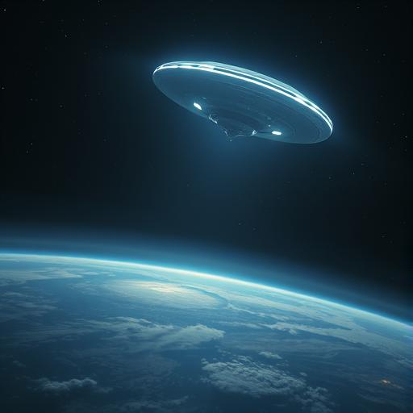

# Chapter 4: The Truth About the Stars {#chapter-4}

## Griffith Observatory, Los Angeles

## 8:42 a.m. local time

The golden light hovered in front of Sarah Chen, waiting for her response.

"Show us," she finally said. "Show us everything."

*Be ready,* warned the voice of the Anari. *The truth will be hard to bear.*

The light exploded.

Not physically—but in their minds, the universe unfolded like a cosmic flower. Sarah saw stars she didn’t recognize,
worlds bathed in alien suns, civilizations that had evolved over thousands of years.

And everywhere, the same pattern: harmony, progress, peace.

Then came the Vak'tar.

Sarah saw it from the victims’ perspective—tiny mechanical parasites emerging from nowhere. She watched them bore into
brains, erase personalities, and turn peaceful beings into sadistic killers.

*Twenty-three worlds,* whispered the Anari voice. *Twenty-three civilizations. All destroyed before we arrived in time.*

Daryl Mensah covered his face with his hands. "Jesus Christ. All those people..."

*Not people. But just as valuable. Just as... innocent.*

The visions shifted. Now they saw the Anari—beings of radiant light, breathtaking in beauty and complexity. They moved
among the stars like living thoughts, healing worlds, bringing hope.

But always too late. Always one step behind the Vak'tar.

*Until now,* the voice said, as a new image formed: Earth, seen from above. But not the Earth as it was—the Earth as it
could be.

Crystal-clear oceans. Cities merged with nature. People traveling among the stars. No wars. No poverty. No disease.

"That... that's impossible," Aida whispered, her fingers trembling above her laptop keyboard.

*Not impossible. Inevitable. If you survive.*

Father Martinez stepped forward. "And if we don’t?"

The vision darkened. They saw Earth as a dead rock—its oceans boiled away, its forests scorched. Seven billion corpses
turned to dust.

*The Vak’tar feed on pain,* explained the Anari. *But when the pain ends—when all are dead—they move on. And nothing
remains.*

Miriam Košová had tears in her eyes. "Why are you telling us this? Why show us... the end?"

*Because you have the right to know. And because you still have a choice.*

"A choice?" Sarah frowned. "Between what?"

The golden light pulsed, and suddenly they were no longer standing in the observatory parking lot. They were...
somewhere else.

A space of pure light—endless and warm. Other figures moved in the distance. More Anari, Sarah realized. Hundreds of
them.

*Welcome to our Council,* said a new voice, deeper and older than the first. *I am Elyon, speaker for the Anari. We have
long debated your fate.*

"Our fate?" Daryl reached instinctively for his weapon, but found only light.

*The Vak’tar main fleet will reach your system in 47 hours and 23 minutes. Two thousand ships. Millions of parasites.
Enough to take over every human on your planet within hours.*

Aida let out a bitter laugh. "So we’re screwed."

*Normally... yes. But not this time.*

Elyon floated closer. Sarah saw that the being of light wasn’t just energy—there were structures, almost like a face,
but infinitely more complex.

*For the first time, we’ve reached them before they could complete their mission. For the first time, we can intervene
before a world is lost. But...*

"But?" Father Martinez already sensed the answer.

*But we cannot fight for you. That would violate our most sacred laws. We can only... equip you.*

"With what?" Sarah asked.

Elyon extended what might have been arms, and the chamber of light exploded into color. Technologies Sarah couldn’t even
begin to comprehend. Weapons that rewrote matter. Healing devices that could reverse death itself. Ships capable of
crossing dimensions.

*Ten thousand years of Anari science. Everything we know. Everything we are. We give it to you.*

"Why?" Miriam asked, bewildered. "Why would you do so much for strangers?"

*Because you are not strangers. And because we owe a debt.*

The visions changed again. This time, they saw a different world—a blue planet with two moons and violet oceans.

*This was Kythara. Our home. Four thousand years ago.*

They saw a civilization of staggering beauty. Beings of light living in harmony, creating art, exploring the mysteries
of the universe.

Then the Vak’tar came.

*We were young. Naive. We believed all beings were good at heart. When the parasites arrived, we welcomed them as
guests.*

Sarah saw the slaughter—millions of Anari destroyed by creatures that had once been their kin.

*The Vak’tar were originally Anari,* Elyon explained, his voice filled with infinite sorrow. *A branch of our species
that chose a different path. They believed pain was the key to evolution.*

"Your own people betrayed you," Father Martinez whispered.

*And nearly destroyed us. Only a few survived. We fled to the stars and vowed to protect others from the same fate.*

"But it isn’t working," Daryl said. "They’re always faster than you."

*They were. Until now.*

Elyon drifted toward Sarah. *You, Dr. Chen, were the first to resist a Vak’tar. Not by chance—but through sheer will.
You showed us that humans are... different.*

"Different how?"

*More resilient. More unpredictable. The Vak’tar rely on logic and fear. But humans... humans possess something they
cannot understand.*

"What?" asked Aida.

*Hope in the face of reason. Love despite pain. The will to fight—even when the fight seems hopeless.*

Miriam smiled through her tears. "You’re talking about humanity."

*Yes. And that is your greatest weapon.*

The chamber shifted again. Now they stood in what resembled a laboratory—crafted from crystalline light, where thoughts
took shape.

*We will give you everything,* Elyon said. *Technology. Knowledge. Power. But it comes at a price.*

"Of course," Daryl muttered. "There’s always a catch."

*The price is change. You cannot use Anari technology and remain who you were. Your minds must expand. Your bodies
strengthen. Your souls... touched.*

A chill ran through Sarah’s chest. "You’re talking about experimenting on us."

*Not experiments. Evolution. Accelerated—but voluntary.*

Father Martinez shook his head. "How do we know you’re not manipulating us like the parasites do?"

*Because we offer you the choice.*

Suddenly, they were back in the observatory parking lot. The sun was shining. Birds chirped. Normal sounds in a normal
world. As if it had all been a dream.

But the golden lights still hovered above them.

*You have six hours,* said Elyon. *Then we must begin—or it will be too late. Each of you must decide.*

Sarah looked at the faces of her newfound allies. Five people from different worlds, cultures, and beliefs—united only
by what they had survived.

"What happens if we say no?" she asked.

*Then you fight as you are. And die as you are. With honor—but without hope.*

"And if we say yes?"

*Then you become something new. Something that walks among the stars. Something that not only survives this war—but
might change the universe.*

Aida tapped nervously at her keyboard. "I'm getting new data," she said quietly. "The Vak’tar fleet... they’ve increased
speed."

"How much time do we have?" asked Daryl.

"Thirty-six hours. Maybe less."

Silence fell over the group.

Father Martinez was the first to speak. "I’ve spent my life believing there’s something greater than us—something that
guides us, if we let it." He looked up at the golden lights. "Maybe... this is my answer."

Miriam nodded. "I think of the children I tried to protect. All the children in the world. If there’s even a chance..."

"I’m a soldier," said Daryl. "Soldiers fight—whatever the weapon."

Aida closed her laptop. "I’ve spent my life breaking through barriers. Firewall after firewall. Maybe this is just the
final one."

All eyes turned to Sarah.

She thought of the voice in her head. The loss of control. The fear. Then she thought of Mrs. Patterson. Of all those
who had died tonight. Of all those still to come.

"I’m a neurologist," she said at last. "I study the brain, the mind, what makes us human. If we have a chance to
preserve that—not just for us, but for everyone—then we have to take it."

She looked up at the Anari. "We’re ready."

*Then let us begin,* said Elyon. *Let us show you what humanity can become—when it opens its heart to the stars.*

The golden light grew brighter. Brighter still, until it filled everything.

And Sarah Chen, neurologist from San Francisco, felt her mind expand and touch things she’d never believed possible.

The war for Earth had begun.

But maybe—just maybe—humanity would not end as victims this time.

But as something entirely new.

---

## 34 hours until the arrival of the Vak’tar main fleet
