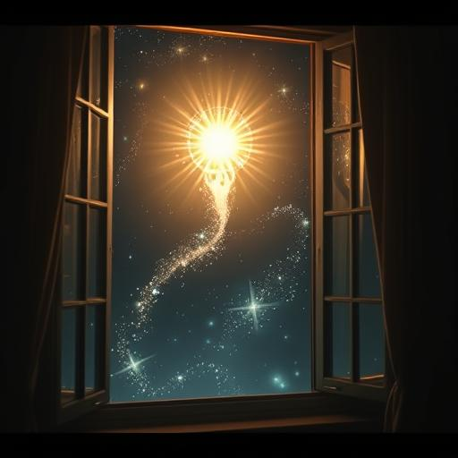

# Chapter 5: Metamorphosis {#chapter-5}

## Griffith Observatory, Los Angeles

## 10:17 a.m. local time

Sarah Chen died at 10:17 a.m. on a Tuesday morning.

Not physically. Her heart kept beating, her lungs kept breathing, her blood kept flowing. But the woman she had been—the
neurologist, the skeptic, the scientist who trusted in the limits of reason—was no more.

The golden light didn’t just pass through her. It *became* her.

She felt her consciousness expand like an inflating balloon. But instead of bursting, it grew endlessly. She saw through
her own eyes—and through the eyes of others. Daryl, screaming in pain. Aida, whose laptop now displayed languages never
written by human hands. Father Martinez, weeping and praying as his faith unraveled and reformed. Miriam, her thoughts
flooded with the memory of children—every recollection crystallizing into perfect clarity.

*Don’t be afraid,* Elyon whispered—but the voice came from within now, not outside. *You’re not dying. You’re being
born.*

Sarah tried to speak, but her words emerged as golden light. Pulsing. Alive with meaning.

**I don’t understand,** her glow responded.

*You will. Soon.*

Her body began to change. Not visibly, not dramatically—but deeply. She sensed new neural pathways forming, her brain
rewiring itself. Her vision stretched beyond the visible spectrum. She saw the infrared heat of nearby bodies, the
electromagnetic shimmer of thought, the gentle hum of gravitational waves coursing through the observatory.

And then she heard it.

The universe was speaking.

Not in words, but in patterns. Energy signatures from distant stars. Quantum pulses carrying intent. The endless murmur
of civilizations whispering across the galaxies.

Sarah had always believed Earth was silent. Now she understood—she had been deaf.

*This is the first step,* Elyon explained. *Expanded awareness. Now you can hear the Vak'tar.*

On cue, a new frequency pulsed into Sarah’s mind. Cold. Hungry. Like the droning of a billion insects closing in on a
feast.

The Vak’tar fleet.

*They arrived early,* Daryl pulsed, his new voice laced with dread. **Sixteen hours early.**

Sarah turned her senses to the solar system’s edge. Beyond Pluto, she saw them—black ships that devoured light.
Thousands of them, like viral swarms racing toward a living world.

**How long?** asked Aida.

*Eighteen hours,* Elyon answered. *Maybe less if they accelerate.*

Father Martinez radiated divine fury: **Then there’s no time for a gentle transformation.**

*No. We must begin Phase Two.*

**Phase Two?** Sarah’s amplified mind trembled.

*Physical augmentation. Combat readiness. It will be… painful.*

The golden light intensified. Sarah felt a force working inside her cells—rewriting DNA not from the outside, but from
within. Her body began to evolve.

Then came the pain.

She dropped to her knees—but never hit the ground. She floated, held by forces she couldn’t name. Around her, the others
screamed—but their screams became beams of light, flickering in the air.

Her muscles compressed, densified, strengthened. Her bones hardened into something stronger than steel, lighter than
carbon. Her heartbeat slowed, grew deeper, pumping nanobot-enhanced blood—Anari tech, active at the cellular level.

*Your reflexes,* Elyon explained, *are now a hundred times faster than a normal human's. You can dodge a bullet… after
it's fired.*

**And that’s just the beginning,** came a new voice—Aida’s, now sounding like a sentient algorithm. **I can tap into any
frequency, hack any database, override any system. It’s… astounding.**

Sarah turned toward her. Aida’s body looked unchanged—slim, pale, short dark hair. But her eyes shimmered. And within
them, Sarah saw torrents of data streaming like light.

Daryl stood and flexed his abilities. He leapt—and landed on the observatory roof, twelve meters up. Then leapt again,
landing softly like a leaf on the wind.

**Holy shit,** he laughed. **This beats every drug I’ve ever tried.**

Father Martinez knelt, eyes closed. But Sarah could see his aura—a quiet, powerful field wrapping them all in a
protective glow.

**I feel your pain,** he whispered. **And I can heal it.**

Miriam pulsed with maternal warmth: **I can sense every lifeform within five kilometers. Every child. Every survivor.
They’re not alone.**

*Excellent,* Elyon said. *But these are just your baseline upgrades. For real combat—you’ll need weapons.*

The air shimmered. Objects materialized before each of them.

Before Sarah: a device between medical scanner and weapon. **Neural Disruptor,** said Elyon. **It extracts Vak’tar
parasites from hosts—without killing the host.**

Before Daryl: a silvery liquid, shape-shifting into any weapon he imagined. **Adaptive Combat Gear. Thought-controlled.
**

Before Aida: a sleek module, humming with quantum energy. **Quantum Network Interface. You can access any system in the
universe.**

Before Father Martinez: a crystalline staff of light. **Healer’s Focus. You can restore life where death is not yet
final.**

Before Miriam: a star-shaped pendant. **Empathy Amplifier. You can influence emotions across vast distances.**

Sarah lifted her device. It pulsed—warm, aware. As her fingers touched it, knowledge surged into her. Instinctively, she
understood how to use it.

**This is beyond belief,** she radiated. **But… are we still human?**

*You are more than human,* Elyon said. *But your humanity remains. That is the difference between evolution and
conquest.*

Suddenly, an alarm surged through their shared consciousness.

Aida flared with panic: **The Vak’tar vanguard—they’ve entered the solar system!**

Sarah focused. Three ships—sleek, black, lethal—skimming the outer planets.

**Scouts,** confirmed Elyon. **They’re probing your defenses.**

**What defenses?** Daryl asked wryly.

*You.*

Sarah rose. She felt power in her limbs, clarity in her mind. “Then let’s show them Earth isn’t defenseless anymore.”

**How?** asked Miriam.

Sarah smiled—and her smile glowed. “By paying them a visit.”

*Now that,* Elyon said with what sounded like pride, *is very human.*

---

## 15 minutes later

Sarah stood on what used to be the Griffith Observatory parking lot. Now it was a landing site for five vessels of
glowing liquid light.

**Anari ships,** explained Elyon. **They respond to thought.**

Sarah touched the nearest one. It felt warm—alive. As she peered in, it bloomed open like a flower.

No seats. No controls. Just a chamber of softly pulsing light.

She stepped inside—and the ship linked with her mind. She was no longer *in* the ship. She *was* the ship. Every sensor,
her skin. Every weapon, her hand. Every thruster, her muscle.

**Ready?** Daryl beamed from his own ship.

**Ready,** came the chorus of four voices.

Sarah thought *up*—and the ship obeyed. Not like a machine, but like a limb.

She soared into the sky, through the atmosphere, and into the blackness of space.

The others followed—five stars blazing toward the heavens.

**My God,** Father Martinez breathed. **Is that…?**

**Earth,** Miriam finished, reverent.

From up here, it looked so small. So fragile. A blue marble adrift in darkness. Exposed. Alone.

Sarah scanned the Vak’tar scouts: three ships orbiting Mars. Insectoid. Angular. Menacing.

**Plan?** Aida asked.

Sarah’s instincts surged. Anari battle knowledge ignited within her.

“We show them this world has teeth.”

She thought *attack*—and her ship launched like a golden bolt.

The war for Earth had begun.

But this time, humanity was ready.

---

## 17 hours, 42 minutes until the arrival of the Vak’tar main fleet
