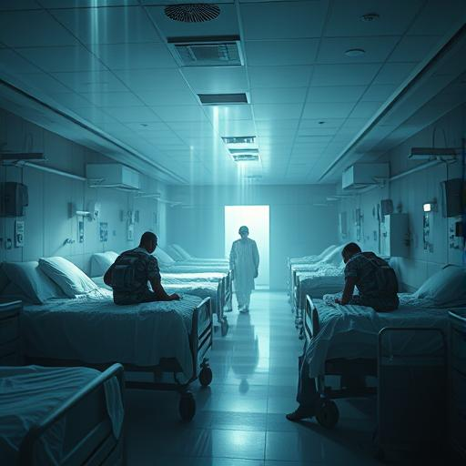

# Kapitel 6: Erstes Blut {#kapitel-6}

## Orbit des Mars {#-orbit-des-mars}

## 11:43 Uhr Erdzeit

Sarah Chen raste mit 50.000 Kilometern pro Stunde auf das erste außerirdische Raumschiff zu, das sie je gesehen hatte,
und fragte sich, ob sie völlig verrückt geworden war.

Das Vak'tar-Schiff war ein schwarzer Dorn gegen das Rot des Mars. Kantig, organisch, wie ein riesiges Insekt aus
lebendem Metall. Es bewegte sich träge durch den Raum, seine Sensoren tasteten methodisch jeden Winkel des Sonnensystems
ab.

**Sie haben uns noch nicht bemerkt**, leuchtete Aida von ihrem Schiff aus. **Ihre Technologie ist darauf ausgelegt,
konventionelle Raumfahrt zu entdecken. Wir fliegen außerhalb ihrer Parameter.**

**Gut**, antwortete Sarah. **Element der Überraschung. Wie Menschen schon immer kämpfen.**

Sie spürte das Gewicht ihrer neuen Verantwortung. Vor wenigen Stunden war sie eine Neurologin gewesen, die schlecht
geschlafen hatte. Jetzt führte sie die erste interplanetare Mission der Menschheit an.

**Formation beibehalten**, befahl sie. **Daryl und ich gehen frontal ran. Aida, versuch ihre Systeme zu hacken. Father
Martinez und Miriam, bleibt zurück und deckt uns ab.**

**Verstanden**, antworteten vier Stimmen gleichzeitig.

Das Vak'tar-Schiff wurde größer. Sarah konnte jetzt Details erkennen – Öffnungen in der Hülle, die wie Mäuler aussahen,
pulsende Adern aus dunklem Licht, die durch die Struktur liefen. Es war nicht nur ein Schiff. Es war ein lebender
Organismus.

**Mein Gott**, flüsterte Father Martinez. **Es ist... wunderschön.**

**Wunderschön und tödlich**, korrigierte Daryl. **Wie eine Cobra.**

Sarah fokussierte ihre erweiterten Sinne auf das Schiff. Jetzt, da sie näher war, konnte sie die Lebensformen darin
wahrnehmen. Hunderte von ihnen. Keine. Nicht Lebensformen. Parasiten. Sie krochen durch das Schiff wie Blut durch Adern.

**Es ist voller Vak'tar**, meldete sie. **Bereitet euch vor.**

Plötzlich veränderte das feindliche Schiff seine Bewegung. Es drehte sich zu ihnen um wie ein Raubtier, das Beute
wittert.

**Sie haben uns entdeckt**, leuchtete Aida. **Ich versuche ihre Kommunikation zu unterbrechen, aber... ihre Technologie
ist anders. Organisch. Wie ein Gehirn.**

Das Vak'tar-Schiff öffnete eine seiner Maul-Öffnungen, und etwas schoss heraus. Nicht ein Projektil – etwas Lebendiges.
Eine schwarze Masse, die sich im Raum ausbreitete wie Tinte im Wasser.

**Was ist das?** fragte Miriam alarmiert.

Sarah spürte es, bevor sie es sah. Millionen winziger Lebensformen, die sich ihnen mit erschreckender Geschwindigkeit
näherten.

**Parasiten-Schwarm**, erkannte sie. **Sie versuchen, unsere Schiffe zu infiltrieren.**

**Dann zeigen wir ihnen, dass Menschen nicht mehr so einfach zu erobern sind**, sagte Daryl grimm.

Sein Schiff verwandelte sich. Das flüssige Licht, aus dem es bestand, härte sich zu etwas aus, das wie geflügelter Stahl
aussah. Waffen materialisierten sich an seiner Hülle – aber keine Waffen, die Sarah kannte. Sie leuchteten mit der
gleichen goldenen Energie wie die Anari.

Daryl feuerte.

Der Lichtstrahl, der aus seinem Schiff schoss, war nicht nur ein Energiestrahl. Er war *intelligent*. Sarah sah, wie er
sich durch den Parasiten-Schwarm wand, jeden einzelnen Organismus anvisierte und vernichtete.

Die schwarze Masse verdampfte wie Rauch.

**Heilige Scheiße**, leuchtete Daryl. **Das war besser als jede Waffe, die ich je benutzt habe.**

**Konzentration**, mahnte Sarah. **Das war nur die erste Welle.**

Das Vak'tar-Schiff reagierte. Seine gesamte Oberfläche begann zu pulsieren, und Sarah spürte, wie sich etwas in ihrem
Kopf zu regen begann. Ein vertrautes Summen. Der Versuch einer Übernahme.

*Kleine Lichtwesen*, flüsterte eine kalte Stimme in ihrem Bewusstsein. *Ihr denkt, ihr könnt uns aufhalten? Wir sind
Legion. Wir sind unvermeidlich.*

**Sie versuchen, uns zu übernehmen**, warnte Sarah. **Mentale Barrieren hoch!**

Aber die Stimme lachte nur. *Ihr seid noch Menschen, tief im Inneren. Und Menschen sind schwach. Sie haben Angst.
Zweifel. Schmerz.*

Plötzlich sah Sarah Visionen. Jenny Martinez, Daryls Partnerin, wie sie auf das Kind zielte. Mrs. Delgado, wie sie das
Messer hob. All die Menschen, die heute Nacht zu Monstern geworden waren.

*Seht ihr?*, flüsterte die Stimme triumphierend. *Ihr seid alle Monster. Wir zeigen euch nur, was ihr wirklich seid.*

Für einen Moment zögerte Sarah. War das wahr? Waren sie wirklich nur Bestien mit einer dünnen Schicht Zivilisation?

Dann hörte sie Father Martinez' Stimme, nicht mental, sondern laut und klar über die Kommunikation:

"Vater unser im Himmel, geheiligt werde dein Name..."

**Was machst du?** fragte Daryl.

**Etwas sehr Menschliches**, antwortete Father Martinez ruhig. **Ich bete. Für uns alle.**

Und plötzlich spürte Sarah es. Wärme, die sich durch ihr Bewusstsein ausbreitete. Nicht die kalte Effizienz der
Anari-Technologie, sondern etwas Tieferes. Älter. Menschlicher.

Hoffnung.

*Das ist unmöglich*, zischte die Vak'tar-Stimme, jetzt unsicherer.

**Nein**, leuchtete Sarah mit neuer Klarheit. **Das ist menschlich. Etwas, das ihr nie verstehen werdet.**

Sie richtete ihren Neuronalen Disruptor auf das feindliche Schiff und feuerte.

Der Strahl war nicht golden wie Daryls Waffen. Er war weiß. Reines, klares Licht, das durch den Raum schnitt wie ein
Skalpell durch Fleisch.

Als er das Vak'tar-Schiff traf, geschah etwas Unerwartetes.

Das Schiff schrie.

Nicht mit Stimmen, sondern mit einer Frequenz, die Sarah in den Knochen spürte. Ein Schrei aus Millionen von Kehlen,
Millionen von gequälten Seelen.

**Es sind nicht nur Parasiten**, erkannte Aida plötzlich. **Das Schiff... es besteht aus eroberten Lebensformen. Sie
haben andere Spezies assimiliert und zu Teilen ihrer Technologie gemacht.**

Sarah sah es jetzt auch. Die "organischen" Teile des Schiffs waren nicht gewachsen – sie waren *einst Lebewesen
gewesen*. Eroberte Aliens, deren Körper und Geist zu lebenden Komponenten umgeformt worden waren.

**Mein Gott**, flüsterte Miriam. **Sie sind Gefangene.**

Father Martinez' Stimme wurde lauter, eindringlicher: "...und führe uns nicht in Versuchung, sondern erlöse uns von dem
Bösen..."

Sarahs Disruptor-Strahl drang tiefer in das Schiff ein. Überall, wo er hindurchging, hörte das Screaming auf.
Stattdessen spürte Sarah... Dankbarkeit. Erleichterung. Frieden.

Sie befreite sie.

**Das ist es**, leuchtete sie triumphierend. **Wir töten sie nicht. Wir befreien sie.**

Die anderen verstanden sofort. Vier Lichtstrahlen trafen das Vak'tar-Schiff von verschiedenen Seiten. Daryl's adaptive
Waffen, Aida's Quantenstrahlen, Father Martinez' Heilungsenergie, Miriam's Empathie-Impulse.

Das Schiff begann auseinanderzufallen. Aber nicht destruktiv – es löste sich auf wie eine Blume, die ihre Blütenblätter
fallen lässt. Millionen von winzigen Lichtpunkten strömten aus seiner Hülle. Befreite Seelen, die endlich ruhen konnten.

Die eigentlichen Vak'tar – die Parasiten – waren ohne ihre eroberten Wirte plötzlich nackt und verletzlich. Sarah sah
sie als das, was sie wirklich waren: winzige, desperate Kreaturen, zusammengekauert in der Kälte des Weltraums.

**Sie sind so... klein**, leuchtete Miriam mit Mitleid.

**Klein und bösartig**, korrigierte Daryl. Er richtete seine Waffen auf die Parasiten-Cluster.

**Warte**, sagte Sarah. Eine Idee formte sich in ihrem erweiterten Bewusstsein. **Aida, kannst du sie einfangen? Lebend?
**

**Warum sollten wir das wollen?**

**Weil sie Informationen haben. Über die Hauptflotte. Über ihre Schwächen.**

Aida's Schiff projizierte ein Energiefeld. Wie ein riesiges Netz sammelte es die verstreuten Vak'tar ein, ohne sie zu
töten.

**Gefangen**, meldete sie. **Aber ich warne euch – sie sind immer noch gefährlich.**

Sarah blickte zu den beiden anderen Vak'tar-Schiffen hinüber, die sich jetzt ihnen näherten. Langsamer, vorsichtiger.
Sie hatten gesehen, was mit ihrem Kameraden passiert war.

**Nachricht empfangen**, leuchtete Aida plötzlich. **Die anderen Schiffe senden etwas... es ist keine Sprache, die ich
kenne.**

Father Martinez' Stimme war sanft: **Lass mich versuchen.**

Er erweiterte sein Bewusstsein, berührte die fremden Signale mit seiner neu erworbenen Empathie.

**Sie... sie haben Angst**, berichtete er überrascht. **Echte Angst. Und... Verwirrung?**

**Verwirrung worüber?** fragte Sarah.

**Darüber, dass wir ihre Gefangenen befreit haben, anstatt sie zu töten. Das... das ist noch nie passiert.**

Sarah spürte eine Idee aufkeimen. Eine verrückte, unmögliche Idee.

**Sendet eine Nachricht zurück**, befahl sie. **Sagt ihnen... sagt ihnen, dass wir nicht ihre Feinde sind. Dass wir hier
sind, um die Gefangenen zu befreien. Alle Gefangenen.**

**Sarah**, leuchtete Daryl warnend. **Das sind Killer. Monster.**

**Nein**, antwortete sie mit neuer Klarheit. **Das sind die Vak'tar. Die Parasiten sind die Monster. Aber diese
Schiffe... sie sind genauso Gefangene wie die Wesen, die sie assimiliert haben.**

Ein langer Moment der Stille. Dann antworteten die anderen beiden Schiffe.

Nicht mit Waffen. Sondern mit einer Nachricht.

Father Martinez übersetzte: **Sie fragen... sie fragen, ob wir ihnen auch helfen können.**

Sarah blickte auf die Erde hinunter, diesen blauen Marmor, der so klein und verletzlich aussah. In siebzehn Stunden
würde eine Flotte von zweitausend solcher Schiffe eintreffen. Jedes voller Millionen von Gefangenen und Tausenden von
Parasiten.

Eine unmögliche Schlacht. Außer...

**Ja**, leuchtete sie zu den Vak'tar-Schiffen hinüber. **Wir können euch helfen. Wir können euch alle helfen.**

**Sarah**, warnte Aida. **Das ist ein enormes Risiko.**

**Das ist Hoffnung**, korrigierte Father Martinez. **Etwas sehr, sehr Menschliches.**

Die beiden feindlichen Schiffe kamen näher. Vorsichtig, wie wilde Tiere, die zum ersten Mal Freundlichkeit erfahren.

**Wenn das funktioniert**, leuchtete Daryl, **dann führen wir nicht nur eine Schlacht. Wir führen eine Befreiung.**

**Und wenn es nicht funktioniert?** fragte Miriam.

Sarah blickte zu ihren vier Gefährten hinüber – diesen unmöglichen Menschen, die zu etwas Neuem geworden waren, aber
ihre Menschlichkeit nicht verloren hatten.

**Dann sterben wir als das, was wir sind. Als Menschen, die versucht haben, das Richtige zu tun.**

Das erste befreite Vak'tar-Schiff näherte sich ihrem Verband. Seine organischen Teile begannen zu leuchten – nicht mit
dem kalten Licht der Parasiten, sondern mit etwas Wärmerem.

**Es transformiert sich**, berichtete Aida erstaunt. **Die befreiten Komponenten... sie bilden etwas Neues.**

**Eine Allianz**, sagte Sarah lächelnd. **Eine Allianz zwischen Menschen und allen, die frei sein wollen.**

Sie blickte hinaus zu den Sternen, wo die Vak'tar-Hauptflotte näher kam.

**Sendet eine Nachricht zur Erde**, befahl sie. **Sagt ihnen, wir kommen heim. Und wir bringen Hilfe mit.**

Der Krieg um die Erde hatte gerade eine völlig neue Wendung genommen.

---

## 16 Stunden, 47 Minuten bis zur Ankunft der Vak'tar-Hauptflotte
