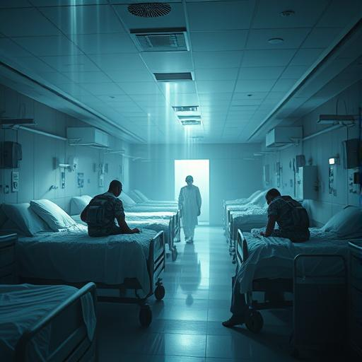

# Chapter 6: First blood {#chapter-6}

## Orbit of Mars {#-orbit-of-mars}

## 11:43 Earth time

Sarah Chen raced towards the first alien spaceship she had ever seen at 50,000 kilometers per hour,
and wondered whether she had gone completely mad.

The Vak'tar ship was a black thorn against the red of Mars. Angular, organic, like a giant insect made of
living metal. It moved sluggishly through space, its sensors methodically scanning every corner of the solar system.
solar system.

**They haven't noticed us yet**, Aida glowered from her ship. **Your technology is designed to detect
conventional space travel. We are flying outside their parameters.

**Good**, Sarah replied. **Element of surprise. How humans have always fought.

She felt the weight of her new responsibility. A few hours ago, she had been a neurologist who had slept badly.
who had slept badly. Now she was leading humanity's first interplanetary mission.

**Keep formation**, she ordered. **Daryl and I are going head-on. Aida, try to hack their systems. Father
Martinez and Miriam, stay back and cover us.

**Understood**, replied four voices simultaneously.

The Vak'tar ship grew larger. Sarah could see details now - openings in the hull that looked like mouths,
pulsing veins of dark light running through the structure. It wasn't just a ship. It was a living
organism.

**My God**, Father Martinez whispered. **It's... beautiful**.

**Beautiful and deadly**, Daryl corrected. **Like a Cobra**.

Sarah focused her enhanced senses on the ship. Now that she was closer, she could see the life forms inside.
the life forms inside. Hundreds of them. None. Not life forms. Parasites. They crawled through the ship like blood through veins.

**It's full of Vak'tar**, she reported. **Prepare yourselves**.

Suddenly, the enemy ship changed its movement. It turned towards them like a predator scenting prey.
scenting prey.

**They've spotted us**, Aida glowed. **I'm trying to disrupt their communications, but... their technology
is different. Organic. Like a brain.

The Vak'tar ship opened one of its mouth openings, and something shot out. Not a projectile - something alive.
A black mass that spread through space like ink in water.

**Miriam asked in alarm.

Sarah felt it before she saw it. Millions of tiny life forms approaching them with terrifying speed.
approaching them.

**Parasite swarm**, she realized. **They're trying to infiltrate our ships**.

**Then we'll show them that humans aren't so easy to conquer anymore**, Daryl said grimly.

His ship transformed. The liquid light it was made of hardened into something that looked like winged steel.
looked like winged steel. Weapons materialized on its hull - but not weapons Sarah knew. They glowed with the
same golden energy as the Anari.

Daryl fired.

The beam of light that shot out of his ship was not just a beam of energy. It was *intelligent*. Sarah saw how it
through the swarm of parasites, targeting and destroying every single organism.

The black mass evaporated like smoke.

**Holy shit**, Daryl lit up. **That was better than any weapon I've ever used**.

**Concentration**, warned Sarah. **That was just the first wave**.

The Vak'tar ship reacted. Its entire surface began to pulsate, and Sarah felt something in her head begin to stir.
something began to stir in her head. A familiar buzzing. An attempt at a takeover.

*Little beings of light*, a cold voice whispered in her consciousness. *You think you can stop us? We are
Legion. We are inevitable.

**They're trying to take us over**, Sarah warned. **Mental barriers up**.

But the voice just laughed. *You are still human, deep down. And humans are weak. They are afraid.
Doubt. Pain.

Suddenly Sarah saw visions. Jenny Martinez, Daryl's partner, aiming at the child. Mrs. Delgado, raising the knife.
Mrs. Delgado raising the knife. All the people who had become monsters tonight.

*You see?* the voice whispered triumphantly. *You are all monsters. We're just showing you what you really are.

Sarah hesitated for a moment. Was that true? Were they really just beasts with a thin layer of civilization?

Then she heard Father Martinez's voice, not mentally, but loud and clear over the comms:

"Our Father in heaven, hallowed be your name..."

**What are you doing?** Daryl asked.

**Something very human**, Father Martinez replied calmly. **I pray. For all of us.

And suddenly Sarah felt it. Warmth spreading through her consciousness. Not the cold efficiency of
Anari technology, but something deeper. Older. More human.

Hope.

*That's impossible,* the Vak'tar voice hissed, more uncertain now.

**No**, Sarah shone with renewed clarity. **This is human. Something you'll never understand.

She aimed her neural disruptor at the enemy ship and fired.

The beam was not golden like Daryl's weapons. It was white. Pure, clear light that cut through the room like a scalpel through flesh.
scalpel through flesh.

When he met the Vak'tar ship, something unexpected happened.

The ship screamed.

Not with voices, but with a frequency that Sarah could feel in her bones. A scream from millions of throats,
millions of tortured souls.

**It's not just parasites**, Aida suddenly realized. **The ship... It's made of conquered life forms. They
have assimilated other species and made them part of their technology.

Sarah saw it now, too. The "organic" parts of the ship had not grown - they *had once been living beings*.
been*. Conquered aliens whose bodies and minds had been transformed into living components.

**My God**, Miriam whispered. **They're prisoners**.

Father Martinez's voice became louder, more insistent: "...and lead us not into temptation, but deliver us from evil...".
evil..."

Sarah's disruptor beam penetrated deeper into the ship. Everywhere it passed through, the screaming stopped.
Instead, Sarah felt... Gratitude. Relief. Peace.

She freed them.

**That's it**, she glowed triumphantly. **We're not killing them. We're freeing them.

The others understood immediately. Four beams of light hit the Vak'tar ship from different sides. Daryl's adaptive
weapons, Aida's quantum rays, Father Martinez's healing energy, Miriam's empathic impulses.

The ship began to fall apart. But not destructively - it disintegrated like a flower that drops its petals.
dropping its petals. Millions of tiny points of light streamed out of its hull. Liberated souls that could finally rest.

The actual Vak'tar - the parasites - were suddenly naked and vulnerable without their conquered hosts. Sarah saw
them for what they really were: tiny, desperate creatures huddled in the cold of space.

**You're so... small**, Miriam lit up with pity.

**Small and vicious**, Daryl corrected. He aimed his weapons at the parasite clusters.

**Wait**, said Sarah. An idea formed in her expanded consciousness. **Aida, can you capture her? Alive?
**

**Why would we want that?**

**Because they have information. About the main fleet. About their weaknesses.

Aida's ship projected an energy field. Like a giant net, it collected the scattered Vak'tar without killing them.
killing them.

**Caught**, she reported. **But I warn you - they are still dangerous**.

Sarah looked over at the two other Vak'tar ships that were now approaching them. Slower, more cautious.
They had seen what had happened to their comrade.

**Message received**, Aida suddenly lit up. **The other ships are sending something... it's not a language I know.
I know.

Father Martinez's voice was soft: **Let me try**.

He expanded his consciousness and touched the foreign signals with his newly acquired empathy.

**They... They're scared**, he reported in surprise. **Really scared. And... Confusion?**

**Confusion about what?** Sarah asked.

**About the fact that we freed their prisoners instead of killing them. That... that's never happened before.

Sarah sensed an idea germinating. A crazy, impossible idea.

**Send a message back**, she ordered. **Tell them... Tell them we are not their enemies. That we are here
are here to free the prisoners. All the prisoners**.

**Sarah**, Daryl lit up in warning. **These are killers. Monsters.

**No**, she replied with renewed clarity. **These are the Vak'tar. The parasites are the monsters. But these
ships... they are as much prisoners as the beings they have assimilated.

A long moment of silence. Then the other two ships responded.

Not with weapons. But with a message.

Father Martinez translated: **They ask... They ask if we can help them too.

Sarah looked down at the earth, this blue marble that looked so small and vulnerable. In seventeen hours
a fleet of two thousand such ships would arrive. Each full of millions of prisoners and thousands of
parasites.

An impossible battle. Except...

**Yes**, she beamed over to the Vak'tar ships. **We can help you. We can help you all.

**Sarah**, Aida warned. **This is an enormous risk**.

**This is hope**, Father Martinez corrected. **Something very, very human.

The two enemy ships came closer. Cautiously, like wild animals experiencing friendliness for the first time.

**If this works**, Daryl lit up, **then we're not just fighting a battle. We're fighting a liberation.

**And if it doesn't work?** asked Miriam.

Sarah looked over at her four companions - these impossible people who had become something new, but had not lost their humanity.
had not lost their humanity.

**Then we die as what we are. As people who have tried to do the right thing.

The first liberated Vak'tar ship approached their convoy. Its organic parts began to glow - not with the cold light of the
the cold light of the parasites, but with something warmer.

**It's transforming**, Aida reported in amazement. **The liberated components... they form something new**.

**An alliance**, Sarah said with a smile. **An alliance between humans and all those who want to be free**.

She looked out at the stars, where the Vak'tar main fleet was approaching.

**Send a message to Earth**, she ordered. **Tell them we're coming home. And we're bringing help.

The war for Earth had just taken a completely new turn.

---

## 16 hours, 47 minutes until the arrival of the Vak'tar main fleet