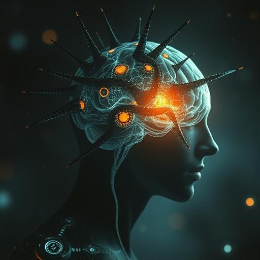

# Kapitel 7: Der Wendepunkt {#kapitel-7}

## Erdorbit {#-erdorbit}

## 13:22 Uhr Ortszeit

Sarah Chen kehrte zur Erde zurück als Anführerin der ersten interplanetaren Allianz in der Menschheitsgeschichte.

Hinter ihr folgten nicht fünf Lichtschiffe, sondern acht. Die drei befreiten Vak'tar-Schiffe hatten sich transformiert –
ihre dunklen, organischen Hüllen leuchteten jetzt mit dem gleichen goldenen Licht wie die Anari-Technologie. Aber sie
sahen anders aus. Nicht mehr wie Insekten oder Raubtiere, sondern wie... Blumen. Komplexe, kristalline Strukturen, die
sich im Sonnenlight wie lebende Juwelen drehten.

**Sie sind wunderschön**, leuchtete Miriam ehrfürchtig.

**Sie sind frei**, korrigierte eine neue Stimme – nicht menschlich, aber warm und melodisch. **Zum ersten Mal seit
Jahrtausenden sind wir frei.**

Die Stimme gehörte zu Zephyr, dem Sprecher der befreiten Schiffe. Sarah hatte gelernt, dass "er" einst ein Wesen namens
Kythran gewesen war – ein Poet-Philosoph von einer Welt mit drei Sonnen. Vor zweihundert Jahren hatten die Vak'tar seine
Heimat erobert, seinen Körper assimiliert, seinen Geist versklavt. Jetzt war er wieder er selbst, befreit von den
Parasiten, die ihn kontrolliert hatten.

**Es ist seltsam**, fuhr Zephyr fort, **nach so langer Zeit wieder zu fühlen. Hoffnung. Dankbarkeit. Und... etwas, das
ihr Menschen "Heimweh" nennt.**

**Für eure ursprüngliche Welt?** fragte Father Martinez mitfühlend.

**Nein. Für die Welt da unten. Euer blauer Planet ist so... lebendig. So voller Möglichkeiten. Wir möchten helfen, ihn
zu beschützen.**

Sarah blickte auf die Erde hinab. Von hier oben sah sie friedlich aus – weiße Wolken über grünen und braunen Landmassen,
blaue Ozeane, die im Sonnenlicht glitzerten. Aber sie wusste, dass unten Milliarden von Menschen auf die Nachrichten
warteten, die sie bringen würde.

**Zeit für die schwierigste Mission von allen**, leuchtete sie. **Wir müssen der Menschheit erklären, dass wir nicht
mehr... nun ja, nur menschlich sind.**

**Und dass wir Alien-Verbündete haben**, ergänzte Daryl. **Das wird interessant werden.**

Aida hatte die ganze Zeit über mit ihrem Quantum-Interface gearbeitet. **Ich habe alle wichtigen Regierungen,
Militärstäbe und Nachrichtenorganisationen der Welt in einem Netzwerk verbunden**, berichtete sie. **Sie können uns alle
gleichzeitig hören.**

**Bereit für die erste Pressekonferenz im Weltraum?** fragte Sarah mit einem schiefen Lächeln.

Sie öffnete einen Kommunikationskanal, der jeden funktionsfähigen Fernseher, Computer und Smartphone auf der Erde
erreichte.

"Menschen der Erde," begann sie, und ihre Stimme wurde in Dutzende von Sprachen übersetzt, "hier spricht Dr. Sarah Chen.
Vor acht Stunden waren wir fünf Überlebende einer Alien-Invasion. Jetzt sind wir die Botschafter einer neuen Hoffnung."

Pause. Sie konnte sich die Verwirrung und Angst vorstellen, die auf der Erde herrschte.

"Die Wesen, die uns angegriffen haben – die Vak'tar – sind Parasiten. Kriminelle, die von ihrer eigenen Spezies
verstoßen wurden. Sie übernehmen nicht nur Menschen. Sie haben Millionen von Spezies in der ganzen Galaxis versklavt.
Aber heute haben wir entdeckt, dass sie verwundbar sind. Und dass wir sie aufhalten können."

Sie aktivierte die visuellen Sensoren, übertrug Bilder von den acht Schiffen in ihrer Formation.

"Die drei neuen Schiffe, die Sie sehen, waren vor wenigen Stunden noch Feinde. Jetzt sind sie Verbündete. Wir haben die
Parasiten entfernt und die ursprünglichen Bewohner befreit. Wesen von anderen Welten, die genauso Opfer waren wie wir."

Eine neue Stimme schaltete sich ein – Zephyr, dessen Worte in melodische Harmonien übersetzt wurden:

"Menschen der Erde, ich spreche zu euch als einer, der zweihundert Jahre lang versklavt war. Eure Spezies hat etwas
Einzigartiges – die Fähigkeit, andere zu befreien, anstatt sie zu zerstören. Ihr habt mir nicht nur mein Leben
zurückgegeben, sondern meinen Willen, meine Seele. Dafür stehen wir in eurer Schuld."

Sarah wartete einen Moment, ließ das wirken. Dann kam der schwierige Teil:

"In vierzehn Stunden wird die Vak'tar-Hauptflotte eintreffen. Zweitausend Schiffe. Aber wir glauben nicht mehr, dass das
eine Invasion ist. Wir glauben, dass es eine Gelegenheit ist – die größte Befreiungsaktion in der Geschichte der
Galaxis."

**Reaktionen von der Erde kommen rein**, meldete Aida. **Und sie sind... gemischt.**

Sarah öffnete einen Audio-Kanal zu den wichtigsten Weltführern.

"Dr. Chen," kam die Stimme des US-Präsidenten, "verstehe ich das richtig? Sie schlagen vor, dass wir nicht kämpfen,
sondern... verhandeln?"

"Nicht verhandeln, Mr. President. Befreien. Die Vak'tar-Schiffe sind voller Gefangener – assimilierte Wesen von
hunderten von Welten. Wenn wir sie befreien können, haben wir plötzlich eine Allianz von Tausenden von Spezies."

Die britische Premierministerin meldete sich: "Das ist ein enormes Risiko, Dr. Chen. Was ist, wenn Sie falsch liegen?
Was ist, wenn es ein Trick ist?"

Father Martinez antwortete: "Dann sterben wir als das, was wir gewählt haben zu sein. Als Befreier, nicht als Eroberer."

Eine neue Stimme – der Generalsekretär der UN: "Dr. Chen, Sie erwähnen, dass Sie und Ihr Team... verändert wurden.
Können Sie das erklären?"

Sarah atmete tief durch. "Wir wurden von den Anari – den ursprünglichen Lichtwesen – verbessert. Körperlich und geistig.
Wir sind immer noch Menschen, aber wir sind auch mehr. Wir können Dinge tun, die normale Menschen nicht können."

"Wie was?" fragte der französische Präsident misstrauisch.

Daryl antwortete: "Ich kann ein Raumschiff mit meinen Gedanken steuern und von hier aus ein Gewehr in Los Angeles
abfeuern, ohne jemanden zu verletzen."

Aida ergänzte: "Ich kann jedes Computersystem auf der Erde gleichzeitig kontrollieren."

Miriam fügte hinzu: "Ich kann die Emotionen von Millionen von Menschen spüren und beeinflussen."

Father Martinez: "Ich kann Tote zurückbringen, wenn der Tod noch nicht endgültig ist."

Sarah schloss ab: "Und ich kann parasitäre Übernehmer aus jedem Lebewesen entfernen, ohne den Wirt zu töten."

Stille. Dann die Stimme des chinesischen Ministerpräsidenten: "Sie beschreiben Götter, nicht Menschen."

"Nein," widersprach Sarah sanft. "Wir beschreiben Menschen, die die Wahl hatten zwischen Tod und Evolution. Und die
Evolution gewählt haben."

**Neue Daten**, meldete Aida plötzlich. **Die Vak'tar-Flotte hat wieder beschleunigt. Ankunft in elf Stunden, vierzehn
Minuten.**

Sarah übertrug diese Information sofort. "Wir haben weniger Zeit als gedacht. Ich brauche eine Entscheidung von den
Regierungen der Erde. Vertrauen Sie uns? Lassen Sie uns versuchen, eine Galaxis zu befreien?"

Lange Stille. Dann die Stimme einer überraschenden Person – ein Kind, dessen Signal sich irgendwie in die Übertragung
eingehackt hatte:

"Warum sollten wir euch nicht vertrauen? Ihr habt uns schon einmal gerettet."

Weitere Stimmen meldeten sich. Nicht von Regierungen, sondern von normalen Menschen:

"Tut es."

"Ihr seid unsere Hoffnung."

"Befreit sie alle."

Die Welle der Unterstützung war überwältigend.

**Die Entscheidung ist gefallen**, leuchtete Sarah zu ihrem Team. **Die Menschheit steht hinter uns.**

"Dr. Chen," meldete sich der UN-Generalsekretär wieder, "was brauchen Sie von uns?"

"Vorbereitung. Wenn das funktioniert, werden wir Millionen von befreiten Aliens haben, die medizinische Hilfe, Nahrung
und temporären Schutz brauchen. Öffnet alle Militärbasen, alle Flughäfen, alle großen Gebäude. Macht die Erde bereit,
Flüchtlinge aus der ganzen Galaxis aufzunehmen."

**Verrückt**, leuchtete Daryl. **Vor einer Woche war ich ein Cop, der Verkehrssünder verfolgt hat. Jetzt organisiere ich
galaktische Flüchtlingshilfe.**

**Das ist Evolution**, antwortete Zephyr philosophisch. **Nicht nur physisch, sondern moralisch. Ihr Menschen entwickelt
euch von einer planetaren zu einer kosmischen Spezies.**

Sarah blickte zu den anderen befreiten Schiffen hinüber. **Könnt ihr andere kontaktieren? Andere assimilierte Schiffe in
der Flotte?**

**Wir versuchen es**, antwortete ein anderer Sprecher – Lyralei, einst eine Meereskreatur von einer Wasserwelt. **Aber
die Vak'tar haben gelernt. Sie blockieren unsere Kommunikation. Sie wissen, dass wir frei sind.**

**Dann werden sie vorbereitet sein**, stellte Father Martinez fest.

**Gut**, sagte Sarah mit einem Lächeln in der Stimme. **Dann können wir ihnen zeigen, wozu Menschen fähig sind, wenn sie
vorbereitet sind.**

Sie wandte sich an die Erde: "Menschen der Erde, in elf Stunden beginnt die Schlacht um die Seele der Galaxis. Nicht nur
um unser Überleben, sondern um die Befreiung von Millionen von versklavten Seelen. Wir sind nicht mehr nur Menschen. Wir
sind Hoffnungsträger."

Pause.

"Macht euch bereit. Wir bringen Gäste mit nach Hause."

---

## Los Angeles, Griffith Observatory

## 14:45 Uhr Ortszeit

Eine Stunde später landeten die acht Schiffe wieder auf dem Parkplatz des Observatoriums. Aber diesmal waren sie nicht
allein.

Hunderte von Menschen hatten sich versammelt. Nicht nur Neugierige, sondern Freiwillige. Ärzte, Krankenschwestern,
Ingenieure, Lehrer, Köche – Menschen, die bereit waren zu helfen.

Als Sarah aus ihrem Schiff stieg, sah sie etwas, das ihr Herz zum Singen brachte: Mrs. Patterson, ihre alte Nachbarin,
stand in der Menge. Lebend, unversehrt, und mit einem Schild in der Hand: "Willkommen zu Hause, Dr. Chen."

"Mrs. Patterson!" Sarah rannte zu ihr und umarmte sie.

"Ich wusste, dass du etwas Besonderes warst, Liebes," sagte die ältere Frau mit Tränen in den Augen. "Aber das hier...
das ist wundervoll."

Zephyr und die anderen befreiten Wesen materialisierten sich neben ihren Schiffen. Sie sahen aus wie Lichtwesen, aber
mit Unterschieden – Zephyr hatte eine schmale, elegante Form, Lyralei fließende, wellenförmige Bewegungen.

Die Menschen in der Menge starrten, aber nicht mit Angst. Mit Ehrfurcht. Mit Willkommen.

Ein kleines Mädchen – vielleicht sechs Jahre alt – lief zu Zephyr und reichte ihm einen Blumenstrauß.

"Danke, dass Sie uns helfen," sagte sie.

Zephyr kniete sich hin und nahm die Blumen entgegen. "Nein, kleine Erdenbewohnerin. Danke, dass ihr uns gezeigt habt,
was Freiheit bedeutet."

Sarah blickte um sich – auf ihre transformierten Gefährten, auf die befreiten Aliens, auf die Menschen, die gekommen
waren, um zu helfen. Auf ihre Heimat, die sich darauf vorbereitete, Zuflucht für eine ganze Galaxis zu werden.

**Elf Stunden**, leuchtete Aida leise.

**Elf Stunden**, bestätigte Sarah. **Dann ändern wir das Universum.**

Sie blickte zu den Sternen hinauf, wo die größte Flotte in der Geschichte der Galaxis auf sie zuraste.

**Kommt nur**, dachte sie. **Wir sind bereit.**

Zum ersten Mal in der Geschichte der Menschheit stand die Erde nicht allein im Universum.

Und sie würde nie wieder allein sein.

---

## 11 Stunden, 14 Minuten bis zur Ankunft der Vak'tar-Hauptflotte
