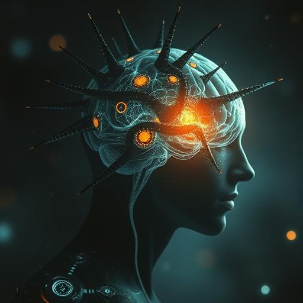

# Chapter 7: The Turning Point {#chapter-7}

## Earth Orbit {#-earth-orbit}

## 1:22 p.m. Local Time

Sarah Chen returned to Earth as the leader of the first interplanetary alliance in human history.

Behind her followed not five lightships—but eight. The three liberated Vak'tar vessels had transformed: their dark,
organic hulls now shimmered with the same golden light as the Anari technology. Yet they looked entirely different. No
longer like insects or predators, but like... flowers. Intricate, crystalline structures spinning in the sunlight like
living jewels.

**They’re beautiful,** Miriam said in awe.

**They are free,** corrected a new voice—not human, but warm and melodic. **For the first time in millennia, we are
free.**

The voice belonged to Zephyr, spokesperson of the freed ships. Sarah had learned that "he" had once been Kythran—a
poet-philosopher from a world with three suns. Two hundred years ago, the Vak'tar had conquered his homeland,
assimilated his body, and enslaved his mind. Now, freed from the parasites, he had reclaimed his identity.

**It’s strange,** Zephyr continued, **to feel again after so long. Hope. Gratitude. And... something you humans call
homesickness.**

**For your original world?** Father Martinez asked gently.

**No. For the world below. Your blue planet is so... alive. So full of possibility. We want to help protect it.**

Sarah looked down at Earth. From here, it seemed peaceful—white clouds drifting over green and brown continents, blue
oceans sparkling in the sunlight. But she knew that billions were waiting for the message she would bring.

**Time for the hardest mission of all,** she said. **We have to explain that we are no longer... just human.**

**And that we’ve made alien allies,** Daryl added. **This’ll be interesting.**

Aida had been working silently through her quantum interface. **I’ve connected every major government, military body,
and media network in a single feed. They can all hear us now.**

**Ready for the first space press conference?** Sarah said with a crooked smile.

She opened a broadcast channel that reached every functioning television, computer, and smartphone on Earth.

"People of Earth," she began, her voice instantly translated into dozens of languages. "This is Dr. Sarah Chen. Eight
hours ago, we were five survivors of an alien invasion. Now, we are ambassadors of a new hope."

She paused, imagining the confusion and fear rippling through the world.

"The beings who attacked us—the Vak'tar—are parasites. Criminals exiled by their own kind. They don’t just take over
humans. They have enslaved millions of species across the galaxy. But today, we discovered they are vulnerable. And we
can stop them."

She activated the visual sensors, broadcasting images of the eight ships in formation.

"The three new ships you see were enemies just hours ago. Now, they are allies. We removed the parasites and freed their
original inhabitants—beings from other worlds who, like us, were victims."

Another voice joined the transmission—Zephyr, translated into harmonious tones:

"People of Earth, I speak to you as one who was enslaved for two centuries. Your species possesses something rare—the
capacity to liberate rather than destroy. You have returned not only my life but my will... my soul. For that, we are in
your debt."

Sarah let that sit. Then came the harder truth.

"In fourteen hours, the Vak'tar main fleet will arrive—two thousand ships. But we no longer see this as an invasion. We
see it as an opportunity: the greatest liberation in galactic history."

**Incoming transmissions from Earth,** Aida reported. **Responses are... mixed.**

Sarah opened an audio channel to global leaders.

"Dr. Chen," said the U.S. President, "are you suggesting we don’t fight... but negotiate?"

"Not negotiate, Mr. President. Liberate. The Vak'tar ships are filled with prisoners—assimilated beings from hundreds of
worlds. If we can free them, we gain an alliance of thousands of species."

The British Prime Minister cut in. "That's an enormous risk. What if you're wrong? What if it’s a trap?"

Father Martinez replied, "Then we die as what we chose to be—liberators, not conquerors."

A new voice, the UN Secretary-General: "Dr. Chen, you mentioned that you and your team have been... changed. Can you
explain?"

Sarah took a deep breath. "The Anari—beings of light—enhanced us, physically and mentally. We’re still human, but also
more. We can do things normal humans can’t."

"Such as?" asked the French President, wary.

Daryl answered, "I can pilot a spaceship with my mind—and fire a gun from orbit without harming anyone."

Aida added, "I can control every computer system on Earth simultaneously."

Miriam: "I can sense and influence the emotions of millions."

Father Martinez: "I can bring back the dead—if their death is not final."

Sarah concluded: "And I can remove parasitic invaders from any living host without harming them."

Silence.

Then the Chinese Premier spoke: "You describe gods, not humans."

"No," Sarah said softly. "We describe humans who chose evolution over death. And evolved."

**New update,** Aida interrupted. **The Vak’tar fleet has accelerated. Arrival in eleven hours and fourteen minutes.**

Sarah relayed the data immediately. "We have less time than expected. I need an answer. Do you trust us? Will you let us
try to free a galaxy?"

A long silence.

Then a child's voice broke in, somehow hijacking the feed:

"Why wouldn’t we trust you? You already saved us once."

More voices followed. Not leaders, but ordinary people:

"Do it."

"You are our hope."

"Free them all."

The wave of support was overwhelming.

**The decision is made,** Sarah said to her team. **Humanity is with us.**

"Dr. Chen," said the UN Secretary-General, "what do you need?"

"Preparation. If this works, we’ll have millions of freed aliens needing medical help, food, and shelter. Open all
military bases, airports, and large facilities. Earth must be ready—to become a refuge for the galaxy."

**Insane,** Daryl said, glowing. **Last week, I was writing traffic tickets. Now I’m planning galactic refugee relief.**

**That is evolution,** said Zephyr, contemplative. **Not just physical, but moral. You humans are evolving—from a
planetary to a cosmic species.**

Sarah turned to the freed ships. **Can you contact others? Other assimilated vessels in the fleet?**

**We’re trying,** replied another voice—Lyralei, once a sea creature from a water world. **But the Vak’tar have adapted.
They’re blocking us. They know we’re free.**

**Then they’ll be ready,** Father Martinez said.

**Good,** Sarah replied with a smile in her voice. **Then we’ll show them what prepared humans can do.**

She turned back to Earth.

"People of Earth, in eleven hours, the battle for the soul of the galaxy begins. Not just for our survival—but for the
liberation of millions of enslaved minds. We are no longer merely human. We are bearers of hope."

Pause.

"Get ready. We’re bringing guests home."

---

## Los Angeles, Griffith Observatory

## 2:45 p.m. Local Time

An hour later, the eight ships touched down again in the observatory parking lot. But this time, they weren’t alone.

Hundreds had gathered. Not just onlookers, but volunteers—doctors, nurses, engineers, teachers, cooks. People ready to
help.

As Sarah disembarked, she saw something that made her heart lift: Mrs. Patterson, her old neighbor, stood in the crowd.
Alive, well, and holding a sign: “Welcome Home, Dr. Chen.”

"Mrs. Patterson!" Sarah ran to her and embraced her.

"I always knew you were special, dear," the older woman said with tears. "But this... this is wonderful."

Zephyr and the other freed beings materialized beside their ships. They looked like beings of light—but each unique.
Zephyr: sleek and elegant. Lyralei: flowing and wave-like.

The crowd stared—not in fear, but in awe. In welcome.

A small girl—maybe six—ran up to Zephyr and handed him a bouquet.

"Thank you for helping us," she said.

Zephyr knelt. "No, little Earth child. Thank you—for showing us what freedom means."

Sarah looked around—at her transformed allies, the freed beings, the humans ready to help. At her world, preparing to
become a sanctuary for the stars.

**Eleven hours,** Aida said softly.

**Eleven hours,** Sarah repeated. **Then we change the universe.**

She looked toward the stars, where the largest fleet in galactic history raced toward them.

**Come then,** she thought. **We’re ready.**

For the first time in human history, Earth was not alone.

And never would be again.

---

## 11 Hours, 14 Minutes Until the Arrival of the Vak’tar Main Fleet
