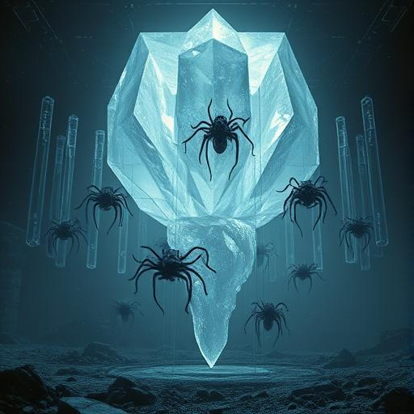

# Chapter 8: The final hour {#chapter-8}

## Griffith Observatory, Los Angeles

## 23:58 local time

In two minutes, the Vak'tar main fleet would reach the solar system.

Sarah Chen stood on the roof of the observatory and looked up at the stars. Around her, the earth had been transformed
transformed into something she would never have thought possible: a galactic welcome palace.
welcome palace.

Runways were lit up all over the planet. Hospitals had opened their doors. Schools had been converted into
had been converted into shelters. In New York, London, Tokyo, Sydney - in every major city in the world, people were waiting with blankets,
food and medical equipment.

"Ready?" Daryl asked, standing next to her. His adaptive armor shimmered like liquid silver in the moonlight.

"No one can be ready for what we're about to do," Sarah replied. "But we are as ready as people can be.
can be."

Father Martinez knelt in meditation, his healing staff glowing gently beside him. Aida had connected to her
quantum interface and was monitoring every communication channel in the solar system. Miriam stood by the three
liberated alien ships and spoke quietly to Zephyr and the others.

**They're coming**, Aida suddenly lit up.

Sarah felt it before she saw it. A wave of cold that rolled through the room. Two hours earlier than
predicted.

They appeared in the sky like a swarm of black stars. Not two thousand ships - Sarah counted quickly - over
three thousand. The Vak'tar had gathered reinforcements.

**My God**, Daryl glowed. **This is more than we expected**.

**Much more**, Zephyr confirmed in his melodic voice. **They have mobilized the entire sector fleet**.

Sarah extended her senses and scanned the incoming armada. Each ship was full of life - but not full of
Vak'tar. Full of prisoners. Millions upon millions of assimilated beings from hundreds of worlds.

**They're not warships**, she suddenly realized. **They are prisoner transports**.

**What do you mean?** Father Martinez asked.

Sarah understood now. **They're not coming to conquer the Earth. They bring all their prisoners with them. Every creature
they've ever assimilated. This isn't just an invasion - this is their entire... Civilization.

**Why would they do that?** asked Miriam.

Zephyr replied with sad certainty: **Because they know they've been discovered. Because they know that the Anari
have finally found a way to stop them. This is their last battle. All or nothing.

Sarah felt the weight of this realization. **If we fail, we don't just lose the earth. We lose any chance
chance to free the millions of prisoners.

**And if we win?** Daryl asked.

**Then we liberate an entire galaxy**, Father Martinez replied with calm certainty.

The ships were approaching. Sarah could see their details now. Each one was different - patched together from the
technologies and bodies of the species they had conquered. A museum of cosmic cruelty.

**Communication received**, Aida reported. **The leader ships are transmitting**.

**Open the channel**, Sarah ordered.

A voice filled her thoughts - cold, complex, like millions of voices speaking at the same time:

*Light beings of Earth. We are the Vak'tar Dominance. You have corrupted our scouts. You have freed our prisoners.
freed our prisoners. That was a mistake.

Sarah answered loudly so that her voice was transmitted over all the Earth's communication channels:

"We are humans. And we are here to free everyone you have enslaved."

*Humans.* The word was pronounced like a curse. *A primitive species from an insignificant planet. You
do not understand what you have done. These beings were weak. We have made them strong.

"You have made them slaves."

*We have improved them. Just like the Anari have improved you. The only difference is that we are honest about the price.
the price*.

Sarah felt a stab of uncertainty. Was that true? Were she and the Vak'tar really that similar?

But then she heard Father Martinez's voice, calm and clear: "The difference is the choice. We have chosen. Your
prisoners did not."

*Election is an illusion*, mocked the Vak'tar voice. *Survival is all that matters. And we will survive.

**They're attacking**, Aida warned.

The three thousand ships suddenly moved with terrifying speed. But not towards the earth - they
spread out in a perfect sphere around the entire solar system.

**They're surrounding us**, Daryl realized.

Sarah understood the strategy immediately. **They want to make sure that no one can escape. Neither us nor their
their own prisoners.

Zephyr lit up with alarmed realization: **It's a trap. For all of them. If they can't win, they will
destroy everything.

**How long do we have?** Sarah asked.

Aida did the math in a flash: **Twelve minutes until they're in attack position**.

Sarah looked over at her team. Five humans and three freed aliens against three thousand ships full of millions of
of parasites.

Impossible chances. But that has always been the hallmark of humanity.

"Time for plan B," she said.

**What's plan B?** Daryl asked.

Sarah smiled - a smile that shone with golden light. "We do what humans do best. We
improvise."

She expanded her consciousness and simultaneously spoke to all the people on Earth and all the prisoners in the
Vak'tar fleet:

"People of the earth. Assimilated beings of the galaxy. My name is Sarah Chen, and I am speaking to you in the darkest hour our
hour our universe has ever seen."

Her voice reached every functioning receiver on Earth and penetrated the communication systems of the Vak'tar ships.
Vak'tar ships.

"The parasites have told you that resistance is pointless. That you are weak. That you need improvement.
But they lie."

In the Vak'tar ships, Sarah felt something begin to stir. Millions of suppressed consciousnesses hearing a different voice
hearing another voice for the first time in centuries.

"You are not weak. You are not broken. You are imprisoned. But captivity is not permanent. Slavery
is not the real you."

**Sarah, what are you doing?" Miriam asked anxiously.

**Something crazy**, Sarah replied. **I'm speaking directly to all the prisoners at once**.

"I know you can hear me. Under the voices of the parasites, under the control, under the pain. Your true
Self is still there. And it's time to wake up."

Suddenly, something unexpected happened. One of the Vak'tar ships - a huge, crystalline dreadnought - began to flicker.
flicker. Its black hull pulsed with faint light.

**A ship reacts**, Aida reported in astonishment.

Then a second. Then a third.

**Possible**, Zephyr glowed. **They can't affect that many ships at once from here**.

But Sarah understood. **We don't have to. We just have to free the first one. Then they'll free each other.

She focused on the flickering ship and sent out every spark of her power. **You are free. Awaken.
Remember who you were.

The ship exploded in light. Not destructively - transformatively. Its dark hull fell away like a shed snakeskin
snakeskin, revealing something beautiful underneath. A ship of living crystal that glowed in all the colors
of the spectrum.

And a wave emanated from this ship. A wave of liberation that spread to the neighboring ships.

**It's working**, Father Martinez shouted triumphantly. **They're freeing themselves**.

But the Vak'tar commanders reacted immediately. The ships that were still under control opened fire - not at the
Earth, but on their own liberated comrades.

**They're attacking their own ships**, Daryl reported in shock.

**They'd rather destroy everything than lose control**, Miriam realized.

Black energy beams flashed back and forth between the ships. Liberated ships glowed and fell back into
darkness. The battle for every single soul had begun.

Sarah saw the chaos and made a decision that would change everything.

"Aida, connect me to every communication device on earth. Daryl, Miriam, Father Martinez - give me your power.
Zephyr and the others - amplify the signal."

**What are you up to?** Daryl asked.

"Something that has never been tried before. I will try to free everyone at the same time."

**That's impossible**, Zephyr warned. **That would kill you**.

Sarah looked up at the struggling ships, at the millions of souls fighting for their freedom.

"Then I'll die a human," she said simply.

She opened her consciousness completely. Every barrier, every protection, every boundary fell away. Her power, reinforced by
the four other humans and the three aliens, poured out like a supernova of pure will.

**I AM SARAH CHEN**, she shone with the power of a sun. **I AM A HUMAN BEING FROM THE EARTH. AND I SAY TO YOU:
YOU ARE FREE**.

The message exploded through the solar system. Every Vak'tar ship was hit simultaneously. Millions of
suppressed consciousnesses heard it and awoke.

For a moment, time seemed to stand still.

Then the greatest light spectacle in the history of the galaxy began.

Ship by ship, fleet by fleet, the prisoners awoke. Black shells fell away, shining, beautiful ships appeared.
ships emerged. Each one different, each one a work of art of its liberated species.

But the price was high. Sarah sank to her knees, her consciousness fading.

**Sarah: Miriam rushed to her.

"Is it... Is it over?" whispered Sarah.

Daryl looked up at what had once been an enemy armada. Now three thousand ships shone in
a rainbow of colors and shapes. A fleet of the liberated.

"It's over," he said quietly. "We've won."

But when he looked again, he saw something that made his blood run cold.

Not all the ships lit up.

In the center of the fleet, surrounded by a dozen still black dreadnoughts, hovered something new. Something that
bigger than all the other ships put together.

The mothership of the Vak'tar.

And it came straight towards the earth.

"Sarah," Daryl said in a raspy voice. "We're not done yet."

---

## 47 minutes until the arrival of the Vak'tar mothership