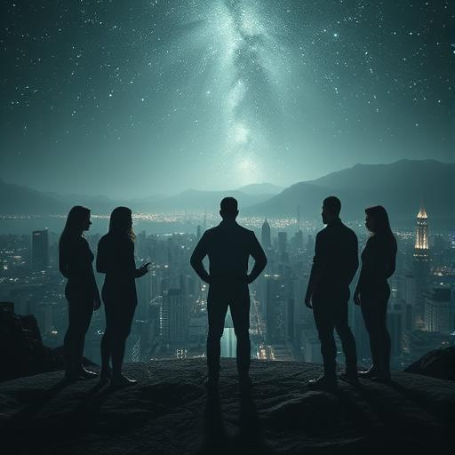

# Kapitel 9: Das Herz der Finsternis {#kapitel-9}

## Erdorbit

## 00:31 Uhr Ortszeit

Das Vak'tar-Mutterschiff war kein Schiff.

Es war eine Welt.

Sarah Chen starrte hinauf zu dem Ding, das sich wie ein schwarzer Mond über die Erde schob, und versuchte zu begreifen,
was sie sah. Hunderte von Kilometern im Durchmesser, eine Kugel aus lebendem Metall und organischem Gewebe, durchzogen
von pulsierenden Adern aus dunklem Licht.

**Mein Gott**, leuchtete Father Martinez schwach. **Es ist... es ist eine ganze Zivilisation.**

Sarah spürte es jetzt auch. Nicht nur Parasiten in diesem Ding. Generationen von Vak'tar, die in symbiotischer Einheit
mit assimilierten Technologien lebten. Eine Mobile Heimatwelt, die seit Jahrtausenden durchs Universum wanderte und
alles verschlang, was sie fand.

**Analyse zeigt**, berichtete Aida mit zitternder Stimme, **über eine Milliarde Lebensformen in dieser Struktur. Aber...
Sarah, da ist noch etwas anderes.**

**Was?**

**Im Zentrum. Etwas Großes. Etwas... Altes.**

Sarah erweiterte ihre geschwächten Sinne und tastete das Herz des Mutterschiffs ab. Was sie fand, ließ ihr das Blut in
den Adern gefrieren.

Eine Präsenz. Riesig, uralte, reine Bosheit. Nicht wie die anderen Vak'tar – nicht hungrig oder gierig. Etwas viel
Schlimmeres.

Etwas, das Freude am Leiden fand.

**Das ist kein Anführer**, flüsterte sie. **Das ist ihr Gott.**

Die Stimme, die antwortete, kam nicht über Kommunikationskanäle. Sie kam direkt aus dem Innersten ihrer Gedanken, bohrte
sich durch alle ihre Verteidigungen wie ein glühender Dorn:

*Endlich. Die kleine Möchtegern-Göttin zeigt ihr wahres Gesicht.*

Sarah schrie auf und sank in die Knie. Die Stimme war nicht nur Kommunikation – sie war ein Angriff, ein Versuch, ihr
Bewusstsein zu zerreißen.

*Ich bin Malgorth*, fuhr die Stimme fort, jedes Wort ein Schlag gegen Sarahs Geist. *Der Erste Vak'tar. Der Ursprung.
Ich war bereits alt, als euer Sonnensystem noch Staub war.*

**Sarah!** Daryl kniete neben ihr nieder, aber als er sie berührte, durchzuckte auch ihn der psychische Schmerz.

*Ihr denkt, ihr habt gewonnen? Ihr habt mir einen Gefallen getan. All diese schwachen Schiffe, diese sentimentalen
Kreaturen – sie waren nur Ballast. Jetzt bin ich frei, euch zu zeigen, was wahre Macht bedeutet.*

Das Mutterschiff begann sich zu öffnen. Nicht wie eine Blüte, sondern wie ein gigantisches Maul. Sarah sah die Reihen
von organischen Kanonen, jede einzelne groß genug, um einen Kontinent zu vernichten.

**Evakuierung der Erde**, befahl sie schwach. **Alle Menschen in die unterirdischen Bunker.**

**Das wird nicht reichen**, leuchtete Zephyr verzweifelt. **Diese Waffen können Planeten spalten.**

*Genau*, lachte Malgorth. *Aber ich werde euch nicht einfach töten. Das wäre zu... langweilig. Ich werde euch zeigen,
was ich mit eurer geliebten Erde machen kann.*

Einer der kleineren Kanonen feuerte einen Testschuss ab. Nicht auf die Erde – auf den Mond.

Der Strahl war dünn, fast elegant. Aber als er den Mond traf, begann die gesamte Oberfläche zu... schmelzen. Nicht durch
Hitze, sondern durch etwas viel Schlimmeres. Die Materie selbst wurde umgewandelt, verwandelte sich in eine schwarze,
lebende Substanz.

**Er infiziert den Mond**, erkannte Aida entsetzt.

*Bald wird euer gesamtes Sonnensystem mein sein*, verkündete Malgorth. *Jeder Planet, jeder Asteroid wird Teil meines
Körpers. Und ihr werdet zuschauen müssen, während ich eure Welt in einen lebenden Albtraum verwandle.*

Sarah zwang sich aufzustehen. Ihr Körper zitterte, ihr Geist war von Malgorths Angriff zerrissen, aber irgendwo tief in
ihr brannte noch immer ein kleiner Funke. Der Funke, der sie zu dem gemacht hatte, was sie war.

Menschlichkeit.

"Nein," sagte sie laut.

*Was sagtest du, kleine Göttin?*

"Ich sagte nein." Sarah richtete sich auf, und mit jedem Wort wurde ihre Stimme stärker. "Sie können unsere Körper
nehmen. Sie können unsere Planeten nehmen. Aber es gibt etwas, das Sie nie nehmen können."

*Und das wäre?*

"Unsere Wahl. In diesem Moment wähle ich, dass Sie hier aufhören."

Malgorth lachte, ein Geräusch wie berstende Welten. *Du willst mich aufhalten? Du, ein winziges Insekt von einem
primitiven Planeten?*

"Nicht ich allein," antwortete Sarah. Sie griff nach den Händen ihrer Gefährten. "Wir."

**Sarah**, warnte Miriam, **du bist zu schwach. Die Befreiung der Flotte hat dich fast getötet.**

"Dann tötet mich das hier eben ganz." Sarah blickte in die Gesichter ihrer Freunde. "Aber nicht, bevor ich diesem Ding
gezeigt habe, was es bedeutet, menschlich zu sein."

**Was hast du vor?** fragte Father Martinez.

Sarah lächelte – ein Lächeln voller Schmerz und Hoffnung. "Etwas, das noch nie jemand versucht hat. Ich gehe da rein."

**Das ist Selbstmord**, protestierte Daryl.

"Nein. Das ist Hoffnung." Sarah blickte hinauf zu dem Mutterschiff. "Malgorth ist alt, mächtig und böse. Aber er ist
auch einsam. Er hat Jahrtausende damit verbracht, zu nehmen, zu zerstören, zu herrschen. Er hat vergessen, was es
bedeutet zu geben. Zu opfern. Zu lieben."

**Du willst einem uralten Alien-Gott Liebe beibringen?** fragte Aida ungläubig.

"Ich will ihm zeigen, was er verloren hat." Sarah wandte sich an die befreite Flotte, die um sie herum schwebte. "
Zephyr, können Sie mich dorthin bringen?"

**Es ist ein Weg ohne Wiederkehr**, warnte Zephyr.

"Ich weiß."

*Komm nur*, höhnte Malgorth. *Ich werde dich langsam zerbrechen. Ich werde dich zu einem Teil meiner Sammlung machen.*

Sarah stieg in ihr Lichtschiff. Aber diesmal war sie nicht allein. Die anderen vier stiegen mit ihr ein.

**Was macht ihr?** fragte sie.

**Du hast gesagt, wir machen das zusammen**, antwortete Daryl. **Menschen halten zusammen.**

**Bis zum Ende**, ergänzte Miriam.

**Was auch immer das Ende sein mag**, fügte Father Martinez hinzu.

**Wir sind ein Team**, schloss Aida. **Teams lassen niemanden zurück.**

Sarah spürte Tränen in ihren Augen – Tränen der Dankbarkeit und der Liebe. **Dann fliegen wir zusammen in die Hölle.**

Ihr Schiff schoss nach oben, gefolgt von Zephyr und den anderen befreiten Schiffen. Nicht als Angreifer, sondern als...
Pilger. Menschen und Aliens vereint in einem unmöglichen Akt des Glaubens.

Das Mutterschiff öffnete seine Defensive nicht. Warum sollte es auch? Was konnten fünf winzige Wesen gegen einen Gott
ausrichten?

Sie flogen in das Maul der Bestie hinein.

Das Innere war... unvorstellbar. Kilometer weite Korridore aus lebendem Fleisch und Metall. Organe so groß wie Städte,
die in unbekannten Rhythmen pulsierten. Und überall die Vak'tar – aber nicht wie die Parasiten, die sie kannten. Diese
hier waren alt, zu organischen Teilen der Struktur geworden.

**Das ist nicht nur ein Schiff**, erkannte Father Martinez. **Das ist ein lebender Organismus. Malgorth IST das Schiff.
**

Sie flogen tiefer, folgten den pulsierenden Arterien zum Herz der Kreatur. Die Temperatur stieg, die Dunkelheit wurde
dichter. Sarahs Sensoren zeigten unmögliche Dinge – Räume, die größer waren als ihre Außenmauern, Korridore, die sich in
Dimensionen erstreckten, die nicht existieren sollten.

Und dann erreichten sie das Zentrum.

Malgorth war... wunderschön.

Nicht im menschlichen Sinne, aber mit einer alien Majestät, die Sarah den Atem raubte. Ein Wesen aus kristallisiertem
Licht und lebendem Schatten, so groß wie ein Hochhaus, schwebend in einer Kammer, die wie ein perverser Tempel aussah.

Aber es waren seine Augen, die Sarah erschütterten. Uralte Augen, die einmal voller Weisheit und Güte gewesen waren.
Jetzt waren sie leer – nicht böse, sondern... hohl.

*Also bist du gekommen*, sagte Malgorth mit einer Stimme wie brechende Kontinente. *Die kleine Möchtegern-Messiasin will
dem Bösen persönlich gegenübertreten.*

"Sie sind nicht böse," sagte Sarah leise. "Sie sind gebrochen."

*WAS?*

Sarah stieg aus ihrem Schiff und ging zu Fuß auf das riesige Wesen zu. Mit jedem Schritt spürte sie Malgorths Macht auf
sie eindrücken, versuchte sie zu zermalmen. Aber sie ging weiter.

"Sie waren einmal wie die anderen Anari, nicht wahr? Ein Lichtwesen. Ein Hüter. Was ist passiert?"

*Schweig!* Malgorths Zorn war eine physische Kraft, die Sarah zu Boden warf. *Du verstehst nichts!*

Aber Sarah stand wieder auf. "Ich verstehe Schmerz. Ich verstehe Verlust. Was haben Sie verloren, Malgorth? Was hat Sie
zu dem gemacht, was Sie sind?"

Für einen Moment – nur einen Moment – flackerte etwas in Malgorths Augen. Etwas, das aussah wie... Trauer.

*Sie starben*, flüsterte er, so leise, dass Sarah es kaum hörte. *Alle. Meine Kinder, meine Geliebte, meine Welt. Eine
Seuche. Ich war der mächtigste Heiler der Anari, aber ich konnte sie nicht retten. Ich konnte... niemanden retten.*

Sarah spürte, wie sich ihr Herz zusammenzog. "Und dann haben Sie angefangen zu nehmen, anstatt zu geben."

*Wenn ich nicht heilen konnte, dann würde ich wenigstens sicherstellen, dass nichts mehr sterben muss. Dass alles Teil
von mir wird. Sicher. Ewig.*

"Aber das ist nicht Leben," sagte Sarah sanft. "Das ist nur eine andere Art des Todes."

*GENUG!* Malgorth erhob sich zu seiner vollen Höhe. *Ich werde dir zeigen, was der Tod wirklich ist!*

Er griff nach Sarah mit Tentakeln aus purem Willen. Aber anstatt wegzulaufen oder zu kämpfen, öffnete Sarah ihr
Bewusstsein. Vollständig. Bedingungslos.

Sie zeigte ihm alles.

Ihre Kindheit. Ihre Träume. Die Nacht, als die Vak'tar kamen. Die Angst, die Hoffnung, den Kampf. Die Freunde, die sie
gefunden hatte. Die Liebe, die sie gelernt hatte. Den Schmerz des Verlustes und die Freude des Wiederfindens.

Sie zeigte ihm Mrs. Patterson mit ihrem Willkommensbanner. Das kleine Mädchen, das Zephyr Blumen gab. Father Martinez,
der für alle betete. Daryl, der seine Waffe wegwarf, um zu beschützen. Miriam, die Kinder rettete. Aida, die ihre Angst
überwand, um zu helfen.

Sie zeigte ihm, was es bedeutete, menschlich zu sein.

Malgorth schrie auf – aber es war kein Schrei des Zorns. Es war ein Schrei der Erkenntnis.

*Was... was hast du mir gezeigt?*

"Ich habe Ihnen gezeigt, was Sie vergessen haben," antwortete Sarah mit Tränen in den Augen. "Dass Liebe stärker ist als
Angst. Dass Geben mehr bedeutet als Nehmen. Dass der Tod nur dann eine Niederlage ist, wenn wir aufhören zu leben, bevor
wir sterben."

Malgorth sank zusammen, seine gigantische Gestalt schrumpfte. Und Sarah sah ihn, wie er wirklich war – nicht ein Gott,
nicht ein Monster, sondern ein gebrochenes Wesen, das so lange gelitten hatte, dass es vergessen hatte, wie Heilung
aussah.

*Ich... ich erinnere mich*, flüsterte er. *Lyraleth. Meine Geliebte. Sie sagte immer... sie sagte, dass die größte Macht
darin liegt, anderen zu helfen, sie selbst zu sein.*

"Sie hatte recht."

*Aber es ist zu spät. Ich habe so viel Schmerz verursacht. So viel Zerstörung.*

Sarah trat näher an das zusammengesunkene Wesen heran. "Es ist nie zu spät für Erlösung. Es ist nie zu spät zu wählen,
wer man sein will."

Malgorth blickte sie an mit Augen, die zum ersten Mal seit Jahrtausenden Hoffnung zeigten.

*Hilf mir*, flüsterte er. *Hilf mir, mich zu erinnern, wie man heilt.*

Sarah legte ihre Hand auf die kristalline Haut des uralten Wesens. "Zusammen," sagte sie. "Wir machen es zusammen."

Licht explodierte aus der Berührung. Nicht das kalte Licht der Technologie, sondern das warme Licht der Vergebung. Es
strömte durch das gesamte Mutterschiff, verwandelte es, heilte es.

Die organischen Wände begannen zu leuchten. Die versklavten Vak'tar erwachten zu neuem Bewusstsein. Die Waffen lösten
sich auf und wurden zu Gärten. Der lebende Alptraum wurde zu einem lebenden Traum.

Und in der Mitte von allem stand Malgorth – nicht mehr ein Gott der Zerstörung, sondern wieder das, was er einst gewesen
war.

Ein Heiler.

*Danke*, sagte er zu Sarah. *Du hast mir gezeigt, dass Erlösung möglich ist. Auch für Monster.*

"Sie waren nie ein Monster," antwortete Sarah. "Sie waren nur... verloren."

Malgorth erhob sich, aber diesmal strahlte er mit der Klarheit eines neu geborenen Sterns.

*Dann lass uns zusammen etwas reparieren, das viel zu lange gebrochen war.*

Er öffnete seine Arme, und sein Licht strömte hinaus zu den dreitausend befreiten Schiffen, zu der Erde, zu jedem Wesen
im Sonnensystem.

Heilung. Nicht nur körperlich, sondern geistig. Emotional. Spirituell.

Die Narben von Jahrtausenden der Unterdrückung begannen zu verblassen.

Und Sarah Chen, Neurologin aus San Francisco, lächelte und wusste, dass die Galaxis nie wieder dieselbe sein würde.

Diesmal war es eine gute Veränderung.

---
