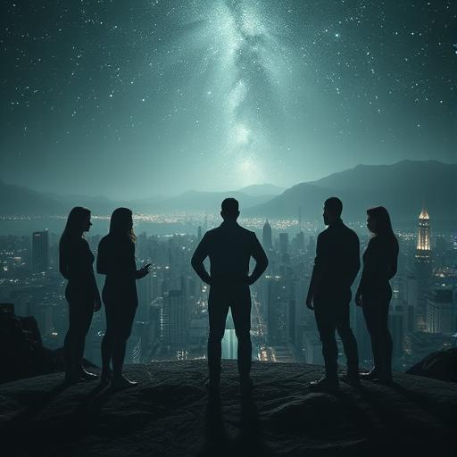

# Chapter 9: The heart of darkness {#chapter-9}

## Earth orbit

## 00:31 local time

The Vak'tar mothership was not a ship.

It was a world.

Sarah Chen stared up at the thing that loomed over the earth like a black moon and tried to comprehend what she was
seeing,
what she was seeing. Hundreds of kilometers in diameter, a sphere of living metal and organic tissue, crisscrossed by
pulsing veins of dark light.
by pulsating veins of dark light.

**My God**, Father Martinez glowed faintly. **It's... it's a whole civilization.

Sarah felt it now too. Not just parasites in this thing. Generations of Vak'tar who lived in symbiotic unity
with assimilated technologies. A mobile homeworld that had been wandering the universe for millennia, devouring
devouring everything it found.

**Analysis shows**, Aida reported with a trembling voice, **over a billion life forms in this structure. But...
Sarah, there's something else**.

**What?**

**In the center. Something big. Something... Old.

Sarah extended her weakened senses and scanned the heart of the mothership. What she found made her blood run cold.
freeze in her veins.

A presence. Huge, ancient, pure malice. Not like the other Vak'tar - not hungry or greedy. Something far
worse.

Something that found joy in suffering.

**This is not a leader**, she whispered. **This is their god**.

The voice that answered did not come through communication channels. It came directly from the depths of her thoughts,
piercing
through all her defenses like a red-hot thorn:

*Finally. The little would-be goddess shows her true colors.

Sarah cried out and sank to her knees. The voice wasn't just communication - it was an attack, an attempt to tear her
to tear her consciousness apart.

*I am Malgorth,* the voice continued, each word a blow to Sarah's spirit. *The First Vak'tar. The origin.
I was old when your solar system was still dust.

**Sarah!** Daryl knelt down beside her, but when he touched her, the psychic pain jolted through him as well.

*You think you've won? You've done me a favor. All those weak ships, those sentimental creatures
creatures - they were just ballast. Now I am free to show you what true power means.

The mothership began to open. Not like a flower, but like a gigantic mouth. Sarah saw the rows
of organic cannons, each one big enough to destroy a continent.

**Evacuate Earth**, she ordered weakly. **Everyone into the underground bunkers**.

**This won't do**, Zephyr glowered desperately. **These weapons can split planets**.

*Exactly*, Malgorth laughed. *But I won't just kill you. That would be too... boring. I'm going to show you,
what I can do with your beloved Earth.

One of the smaller cannons fired a test shot. Not at the earth - at the moon.

The beam was thin, almost elegant. But when it hit the moon, the entire surface began to... melted. Not from
heat, but by something much worse. The matter itself was transformed, turned into a black,
living substance.

**He's infecting the moon**, Aida realized in horror.

*Your entire solar system will soon be mine*, Malgorth announced. *Every planet, every asteroid will become part of my
body. And you will have to watch while I turn your world into a living nightmare.

Sarah forced herself to stand up. Her body trembled, her mind was torn apart by Malgorth's attack, but somewhere deep
inside
she still had a little spark burning. The spark that had made her what she was.

Humanity.

"No," she said aloud.

*What did you say, little goddess?

"I said no." Sarah straightened up, her voice growing stronger with each word. "They can take our bodies.
take our bodies. You can take our planets. But there's something you can never take."

*And that would be?*

"Our choice. At this moment, I choose for you to stop here."

Malgorth laughed, a sound like worlds bursting. *You want to stop me? You, a tiny insect from a
primitive planet?*

"Not me alone," Sarah replied. She reached for the hands of her companions. "We."

**Sarah**, Miriam warned, **you're too weak. The liberation of the fleet almost killed you.

"Then this kills me completely." Sarah looked at the faces of her friends. "But not before I've shown this thing
what it means to be human."

**What are you up to?** Father Martinez asked.

Sarah smiled - a smile full of pain and hope. "Something no one's ever tried before. I'm going in there."

**This is suicide**, Daryl protested.

"No. This is hope." Sarah looked up at the mothership. "Malgorth is old, powerful and evil. But he is
lonely, too. He's spent millennia taking, destroying, ruling. He has forgotten what it means
means to give. To sacrifice. To love."

**You want to teach love to an ancient alien god?** Aida asked incredulously.

"I want to show him what he's lost." Sarah turned to the liberated fleet hovering around her. "
Zephyr, can you take me there?"

**It's a road of no return**, Zephyr warned.

"I know."

*Come on*, Malgorth sneered. *I'll break you slowly. I'm going to make you part of my collection.

Sarah climbed into her lightship. But this time she wasn't alone. The other four got in with her.

**What are you doing?** she asked.

**You said we do this together**, Daryl replied. **People stick together**.

**Until the end**, Miriam added.

**Whatever the end may be**, Father Martinez added.

**We are a team**, Aida concluded. **Teams leave no one behind**.

Sarah felt tears in her eyes - tears of gratitude and love. **Then we'll go to hell together**.

Their ship shot upwards, followed by Zephyr and the other freed ships. Not as attackers, but as...
Pilgrims. Humans and aliens united in an impossible act of faith.

The mother ship did not open its defenses. Why should it? What could five tiny beings do against a god?
against a god?

They flew into the mouth of the beast.

The inside was... unimaginable. Kilometers of corridors of living flesh and metal. Organs as big as cities,
that pulsed in unknown rhythms. And the Vak'tar everywhere - but not like the parasites they knew. These
here were old, had become organic parts of the structure.

**This is not just a ship**, Father Martinez realized. **This is a living organism. Malgorth IS the ship.
**

They flew lower, following the pulsing arteries to the creature's heart. The temperature rose, the darkness became
denser. Sarah's sensors showed impossible things - rooms larger than their outer walls, corridors that stretched into
dimensions that shouldn't exist.
dimensions that should not exist.

And then they reached the center.

Malgorth was... beautiful.

Not in the human sense, but with an alien majesty that took Sarah's breath away. A being of crystallized
light and living shadow, as big as a skyscraper, floating in a chamber that looked like a perverted temple.

But it was his eyes that shook Sarah. Ancient eyes that had once been full of wisdom and kindness.
Now they were empty - not evil, but... hollow.

*So you've come*, Malgorth said in a voice like breaking continents. *The little would-be messiah wants to face
to confront evil in person.

"They're not angry," Sarah said quietly. "They're broken."

*WHAT?*

Sarah got out of her ship and walked towards the huge creature. With every step she took, she felt Malgorth's power
pressing down on her, trying to crush her. But she kept walking.

"You were once like the other Anari, weren't you? A being of light. A guardian. What happened?"

*Malgorth's anger was a physical force that knocked Sarah to the ground. *You don't understand!

But Sarah stood up again. "I understand pain. I understand loss. What have you lost, Malgorth? What has made you
made you what you are?"

For a moment - just a moment - something flickered in Malgorth's eyes. Something that looked like... Grief.

*They died*, he whispered, so quietly that Sarah barely heard. *All of them. My children, my beloved, my world. A
plague. I was the most powerful healer of the Anari, but I couldn't save them. I couldn't... save anyone.*

Sarah felt her heart tighten. "And then you started taking instead of giving."

*If I couldn't heal, I would at least make sure that nothing had to die. That everything becomes part
of me. For sure. Forever.

"But that's not life," Sarah said gently. "It's just a different kind of death."

*Malgorth rose to his full height. *I'll show you what death really is!

He reached for Sarah with tentacles of pure will. But instead of running away or fighting, Sarah opened her
consciousness. Completely. Unconditionally.

She showed him everything.

Her childhood. Her dreams. The night the Vak'tar came. The fear, the hope, the fight. The friends she
she had made. The love she had learned. The pain of loss and the joy of finding again.

She showed him Mrs. Patterson with her welcome banner. The little girl who gave Zephyr flowers. Father Martinez,
who prayed for everyone. Daryl, who threw down his gun to protect. Miriam, who saved children. Aida, who overcame her
fear
to help.

She showed him what it meant to be human.

Malgorth cried out - but it was not a cry of anger. It was a cry of realization.

*What... what did you show me?

"I've shown you what you've forgotten," Sarah replied with tears in her eyes. "That love is stronger than
fear. That giving is more than receiving. That death is only a defeat if we stop living before we die.
we die."

Malgorth sank down, his gigantic figure shrinking. And Sarah saw him as he really was - not a god,
not a monster, but a broken being who had suffered for so long that he had forgotten what healing looked like.
looked like.

*I... I remember*, he whispered. *Lyraleth. My beloved. She always said... she said that the greatest power
lies in helping others to be themselves.*

"She was right."

*But it's too late. I have caused so much pain. So much destruction.

Sarah stepped closer to the slumped creature. "It's never too late for redemption. It's never too late to choose
who you want to be."

Malgorth looked at her with eyes that showed hope for the first time in millennia.

*Help me*, he whispered. *Help me remember how to heal*.

Sarah placed her hand on the crystalline skin of the ancient being. "Together," she said, "we'll do it together."

Light exploded from the touch. Not the cold light of technology, but the warm light of forgiveness. It
flowed through the entire mothership, transforming it, healing it.

The organic walls began to glow. The enslaved Vak'tar awoke to new consciousness. The weapons dissolved
and became gardens. The living nightmare became a living dream.

And in the middle of it all stood Malgorth - no longer a god of destruction, but once again what he had once been.
had once been.

A healer.

*Thank you*, he said to Sarah. *You've shown me that redemption is possible. Even for monsters.

"You were never a monster," Sarah replied. "They were just... Lost."

Malgorth stood up, but this time he shone with the clarity of a newborn star.

*Let's fix something together that's been broken for far too long.

He opened his arms, and his light streamed out to the three thousand liberated ships, to the earth, to every being
in the solar system.

Healing. Not just physically, but mentally. Emotionally. Spiritually.

The scars of millennia of oppression began to fade.

And Sarah Chen, a neurologist from San Francisco, smiled, knowing that the galaxy would never be the same again.

This time it was a good change.

---