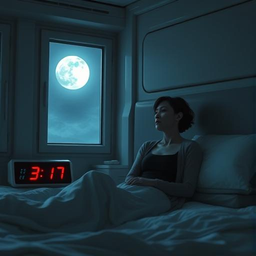
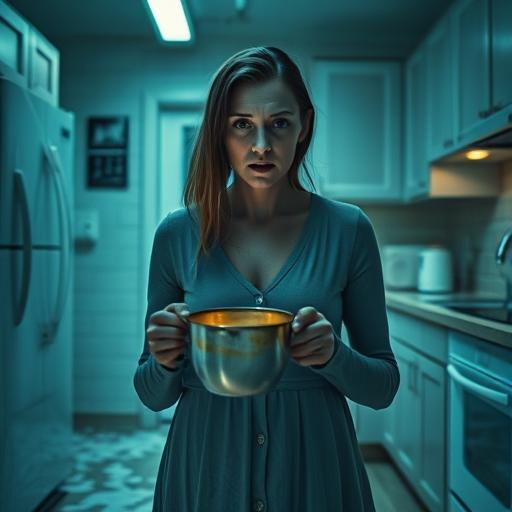
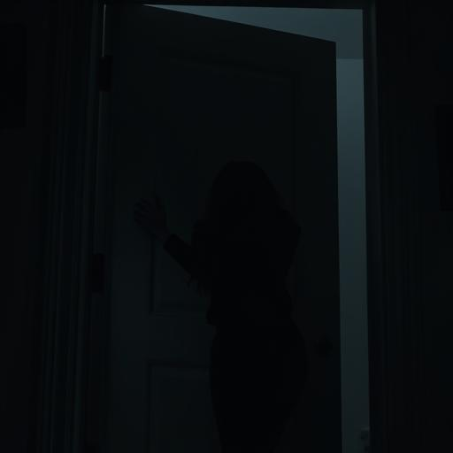
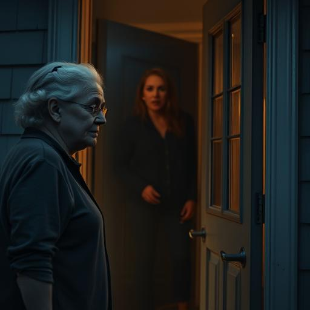
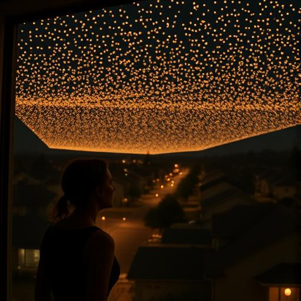
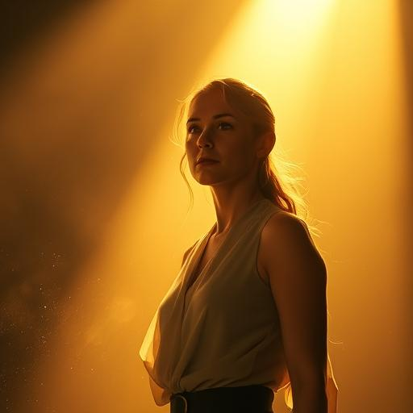

# Storyboard – Kapitel 1: Das Flüstern im Dunkeln

Dieses Storyboard visualisiert die Schlüsselbilder des ersten Kapitels der Geschichte „Die Jäger und die Gejagten“. Jede Szene zeigt einen entscheidenden Moment aus Sarah Chens erster Begegnung mit den Vak’tar-Parasiten.

---

## 🎬 Szene 1 – Sarahs Erwachen

*Sarah sitzt schweißgebadet in einem dunklen, futuristischen Schlafzimmer aufrecht im Bett. Es ist 3:17 Uhr. Der Mond scheint herein. Alles ist zu still.*

---

## 🎬 Szene 2 – Das Summen in der Küche

*Sarah steht in der Küche, als eine fremde Stimme in ihrem Kopf ertönt. Die Milch verschüttet sich, der Topf zerbricht. Ihre Pupillen beginnen zu flackern.*

---

## 🎬 Szene 3 – Panik vor dem Spiegel

*Sarah starrt in den Badezimmerspiegel. Ihre Augen flackern fremdartig. Sie ringt mit der Angst, ihren Verstand zu verlieren.*

---

## 🎬 Szene 4 – Der Kampf an der Haustür

*Sie hält die Haustür zu, aber ihre eigene Hand gehorcht ihr nicht mehr. Eine fremde Kraft zwingt sie, die Tür zu öffnen.*

---

## 🎬 Szene 5 – Mrs. Patterson soll fliehen

*Sarah ruft durch die verschlossene Tür: „Laufen Sie weg!“ Draußen steht die alte Nachbarin, erschrocken im Licht der Veranda.*

---

## 🎬 Szene 6 – Die goldenen Lichter erscheinen

*Hunderte goldener Lichter erscheinen über der Nachbarschaft. Sie bewegen sich geordnet, wie tanzende Sterne. Sarah blickt gebannt nach oben.*

---

## 🎬 Szene 7 – Die Befreiung beginnt

*Das goldene Licht erfüllt das Zimmer. Sarahs Augen flackern ein letztes Mal, dann wird sie klar. Die Stimme in ihrem Kopf verstummt.*

---

> **Hinweis für Produktion**:  
> Diese Bildsequenzen können zur Regieplanung, zum Szenenaufbau oder als Vorlage für Comic-/Film-Adaptionen verwendet werden.
