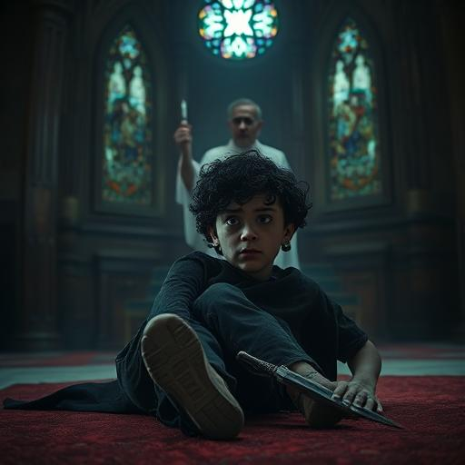
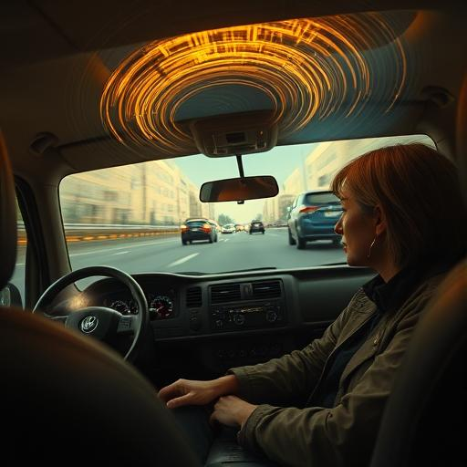
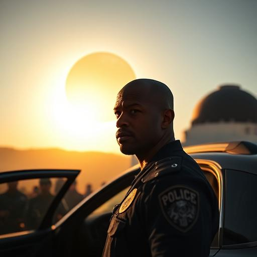
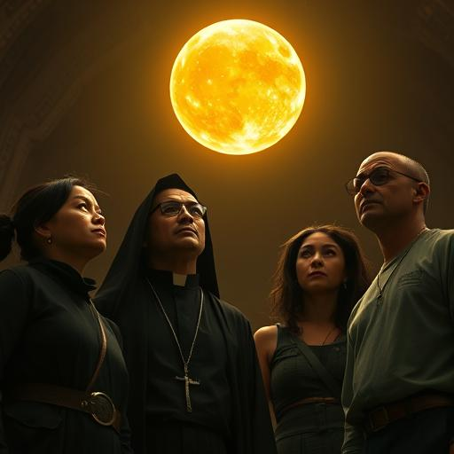

# 🎞️ Storyboard – Kapitel 3: Erste Kontakte

**Schauplätze:**  
- San Francisco, USA  
- Sarajevo, Bosnien-Herzegowina  
- Los Angeles, USA (Griffith Observatory)  

**Stimmung:** Apokalyptisch, mystisch, spannungsgeladen

---

## 🎬 Szene 1: Gebet unter Toten

Father Ignacio Martinez kniet zwischen den Leichen seiner Gemeindemitglieder in einer dunklen Kirche und betet verzweifelt.

---

## 🎬 Szene 2: Miguel verändert sich

Miguel, ein junger Überlebender, liegt hinter dem Altar. Er zeigt Anzeichen einer Besessenheit und greift den Priester mit ruckartigen Bewegungen an.

---

## 🎬 Szene 3: Das Licht vertreibt die Dunkelheit

Ein goldenes Licht explodiert durch die Kirchenfenster und befreit Miguel von der Kontrolle. Die gesamte Kirche leuchtet in übernatürlichem Glanz.

---

## 🎬 Szene 4: Flucht über die Feuerleiter

Aida Ramić klettert in Sarajevo über eine rostige Feuerleiter, während besessene Nachbarn unter ihr lauern. Ein weißer Van wartet in der Gasse.

---

## 🎬 Szene 5: Begegnung im Van

Aida trifft Dr. Sarah Chen im Van. Während Sarah fährt, entschlüsselt Aida Satellitendaten. Am Himmel tanzen goldene Lichter.

---

## 🎬 Szene 6: Ankunft am Griffith Observatory

Daryl Mensah kommt am Griffith Observatory an. Dort versammeln sich Überlebende unter einer goldenen Lichtkugel.

---

## 🎬 Szene 7: Erstkontakt mit den Anari

Sarah, Daryl, Aida, Miriam und Father Martinez stehen gemeinsam unter dem Anari-Licht, das telepathisch mit ihnen kommuniziert. Hoffnung und Entschlossenheit spiegeln sich in ihren Gesichtern.
