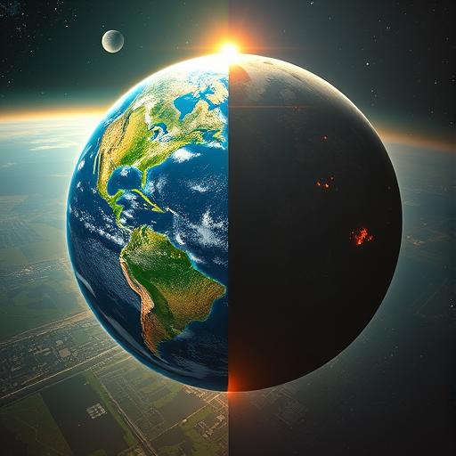
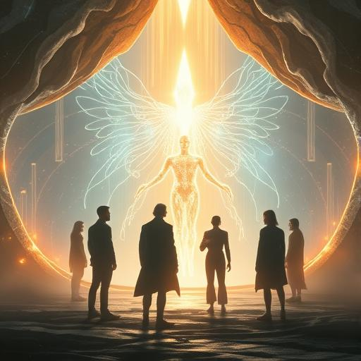
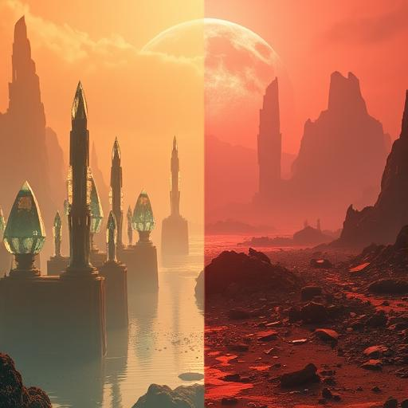
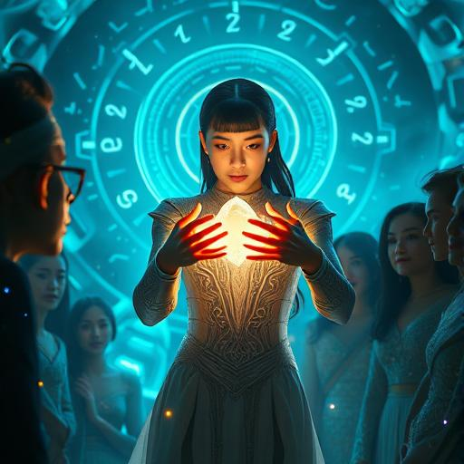
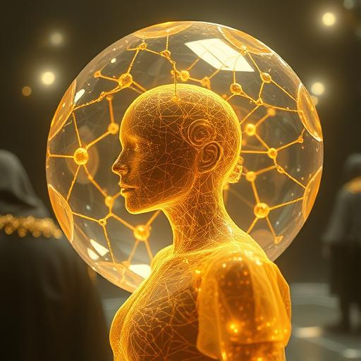
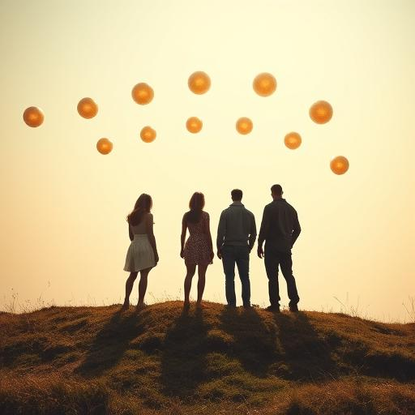
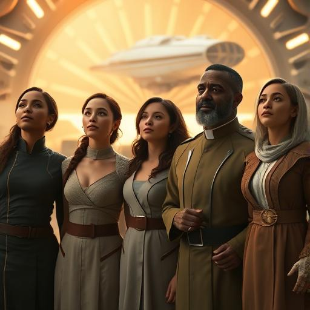

# 🎞️ Storyboard – Kapitel 4: Offenbarung

**Schauplätze:**

- Visionärer Raum der Anari
- Kosmische Projektionen
- Erde, Vergangenheit und Zukunft
- Griffith-Observatorium

**Stimmung:** Erhaben, mystisch, hoffnungsvoll und entschlossen

---

## 🎬 Szene 1: Vision der Galaxien

Goldene Lichtlinien zeigen das Universum: fremde Welten, kosmische Vernetzungen, Szenen vergangener Vak’tar-Invasionen.

---

## 🎬 Szene 2: Zwei mögliche Zukünfte

Die Erde erscheint doppelt: als grüne Utopie und als zerstörte Ödnis. Die Vision gleitet zwischen Hoffnung und Warnung.

---

## 🎬 Szene 3: Der Rat der Anari

Die Gruppe steht in einer Halle aus Licht. Vor ihnen schwebt Elyon, der Anführer der Anari, eine leuchtende Erscheinung.

---

## 🎬 Szene 4: Kythara – Paradies und Ruine

Die Heimatwelt der Anari, Kythara, erscheint in zwei Hälften: einst ein Paradies, dann zerstört von den Vak’tar.

---

## 🎬 Szene 5: Das Geschenk

Dr. Sarah Chen empfängt ein strahlendes Gerät – ein Geschenk der Anari. Die Gruppe wird in schimmerndes Licht getaucht.

---

## 🎬 Szene 6: Transformation im Lichtlabor

Ein kristallines Labor aus Licht. Nanotechnologie beginnt sanft, Körper und Geist der Gruppe zu verbessern.

---

## 🎬 Szene 7: Rückkehr auf die Erde

Die Gruppe steht wieder am Observatorium. Über ihnen schweben goldene Lichter in geordneten Formationen.

---

## 🎬 Szene 8: Der Blick nach vorn

Aida, Sarah, Daryl, Miriam und Father Martinez blicken entschlossen in den Himmel. Die nächste Phase beginnt.
