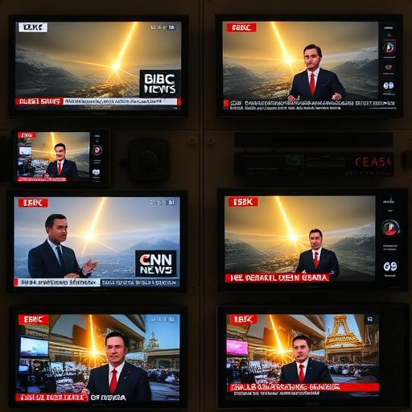
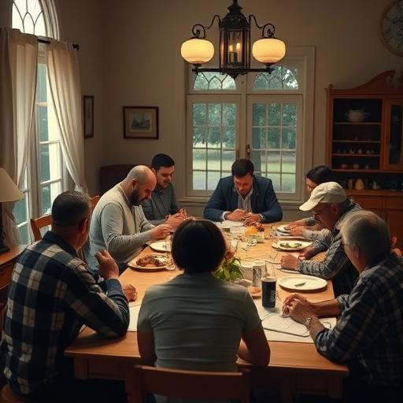
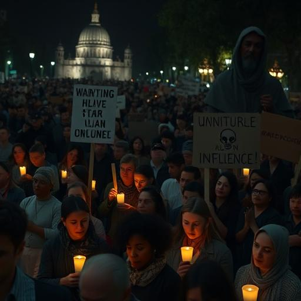
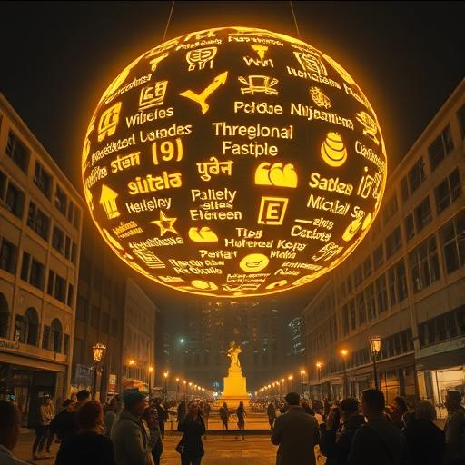
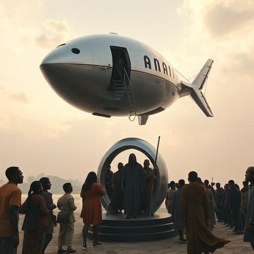
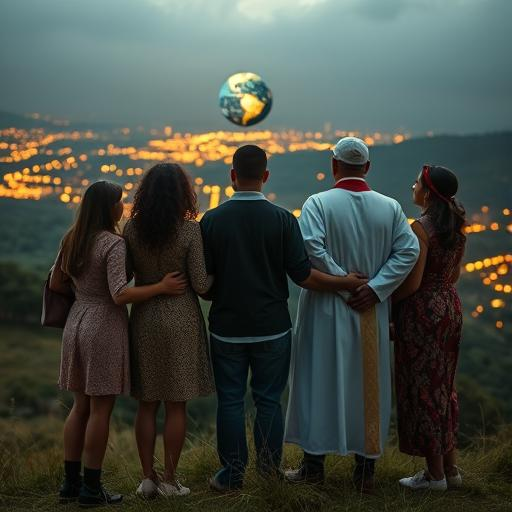
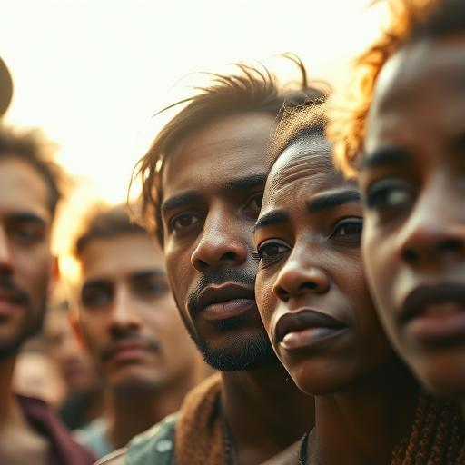

# 🎞️ Storyboard – Kapitel 5: Die Entscheidung der Menschheit

**Schauplätze:**  
- Weltweite Städte und Dörfer  
- Nachrichtensender  
- Öffentliche Plätze, religiöse Räume  
- Anari-Portale weltweit

**Stimmung:** Global, emotional, nachdenklich, hoffnungsvoll

---

## 🎬 Szene 1: Globales Erwachen

Menschen auf der ganzen Welt blicken zum Himmel. Die goldenen Lichter erscheinen – Staunen, Furcht und Hoffnung breiten sich gleichzeitig aus.

---

## 🎬 Szene 2: Medienreaktion

Internationale Nachrichtensender berichten: Auf Bildschirmen sieht man Diskussionen, Erklärungen, Zweifel. Wissenschaft und Religion ringen um Deutungshoheit.

---

## 🎬 Szene 3: Gespräche und Gebete

Menschen sprechen in Wohnzimmern, Kirchen, Moscheen und Parks über das Erlebte. Einige beten, andere streiten – alle suchen Orientierung.

---

## 🎬 Szene 4: Frieden und Protest

Öffentliche Plätze füllen sich: Kerzenlichter, stille Gebete – aber auch Protestplakate gegen fremde Einflüsse. Alles bleibt friedlich.

---

## 🎬 Szene 5: Die große Einladung

Über Stadtplätzen erscheinen goldene Lichter mit symbolischen Botschaften in allen Sprachen. Die Menschheit wird eingeladen, zu wählen.

---

## 🎬 Szene 6: Die Ersten treten ein

In aller Welt treten erste Gruppen mutig in Portale oder Anari-Schiffe. Ihre Gesichter zeigen Angst und Entschlossenheit.

---

## 🎬 Szene 7: Die Hauptgruppe beobachtet

Sarah, Aida, Daryl, Martinez und Miriam stehen auf einem Hügel. Sie sehen der erwachenden Menschheit zu – ein Moment des stillen Stolzes.

---

## 🎬 Szene 8: Der letzte Blick zurück

Nahaufnahme der Gesichter der Hauptfiguren im Licht – ein Moment der inneren Entscheidung. Sie treten gemeinsam ins Unbekannte.

