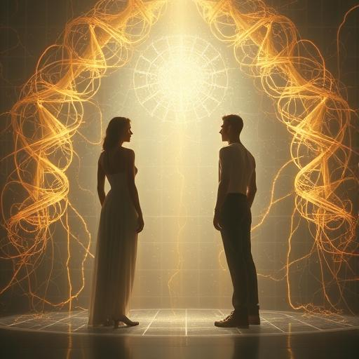
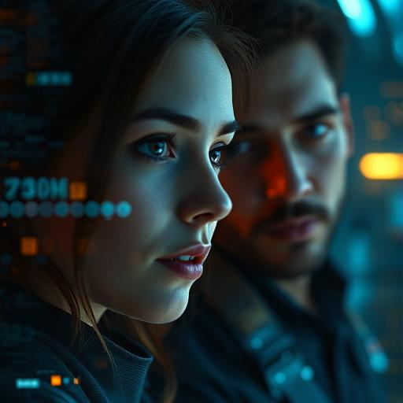
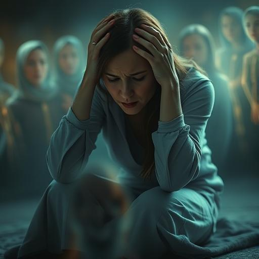
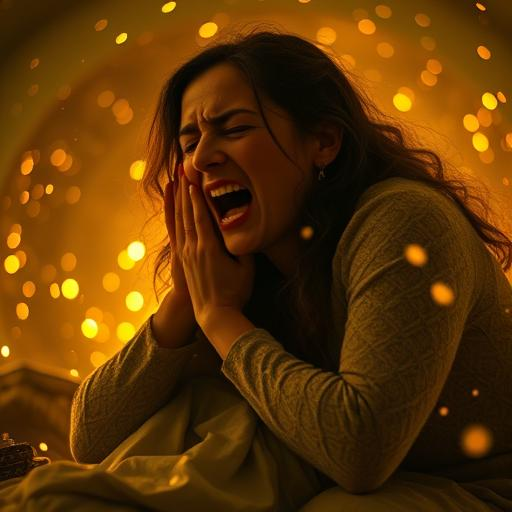
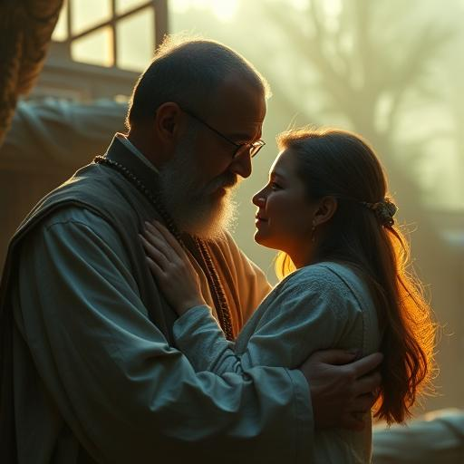
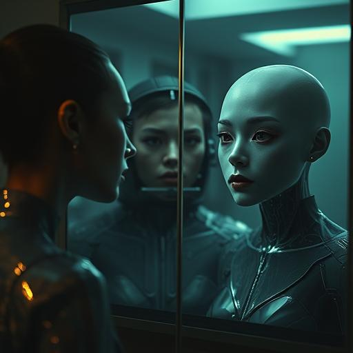

# 🎞️ Storyboard – Kapitel 6: Der Preis der Macht

**Schauplätze:**  
- Anari-Lichtkammern  
- Innere Visionen  
- Meditative und emotionale Räume  
- Spiegelbildliche Selbstbegegnung

**Stimmung:** Intensiv, intim, spirituell, überfordernd und heilend

---

## 🎬 Szene 1: Beginn der Transformation

Die Protagonisten stehen in durchscheinenden Lichtkammern. Schweben leicht, während sich goldene neuronale Netzwerke um sie legen – ruhig, sanft, überirdisch.

---

## 🎬 Szene 2: Neue Fähigkeiten erwachen

Aida sieht digitale Muster mit bloßem Auge. Daryl nimmt Bewegungen verlangsamt wahr. Zwischen ihnen schwebt elektrische Spannung – still und voller Kraft.

---

## 🎬 Szene 3: Mentale Überforderung

Miriam bricht zusammen, hält sich den Kopf. Fremde Gedanken und Eindrücke fluten ihren Geist – sie wirkt verwirrt, erschüttert, verletzlich.

---

## 🎬 Szene 4: Sarahs Vision ihrer Tochter

Sarah sieht ihre verstorbene Tochter – lebendig, lächelnd, greifbar. Die Szene wirkt wunderschön und gleichzeitig zutiefst schmerzhaft.

---

## 🎬 Szene 5: Der emotionale Bruch

Sarah fällt auf die Knie, schreit, weint. Das Licht um sie flackert. Es ist ein Moment tiefster Verzweiflung – roh und menschlich.

---

## 🎬 Szene 6: Martinez bringt Trost

Father Martinez hält Sarah im Arm. Sein Glaube, seine Ruhe helfen ihr. Das Licht beruhigt sich – Wärme kehrt zurück.

---

## 🎬 Szene 7: Die Gruppe ist verwandelt

Alle stehen wieder zusammen – verändert, stärker, aber still. In ihren Augen schimmert goldenes Licht. Sie wissen: Es gibt kein Zurück.

---

## 🎬 Szene 8: Der Blick in den Spiegel

Jeder Charakter steht allein vor einem Spiegel. Sie betrachten sich – ernst, erstaunt, respektvoll. Sie erkennen ihr neues Selbst.

