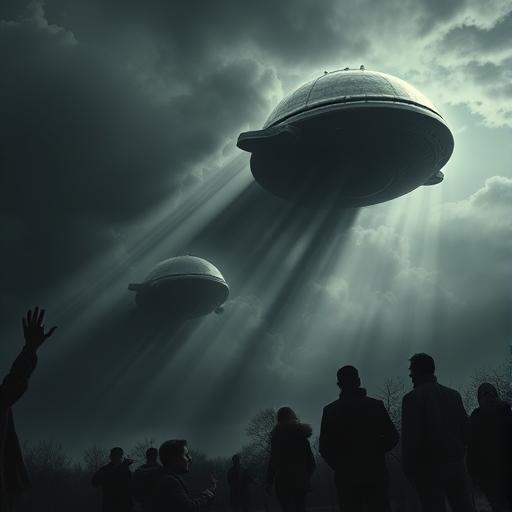
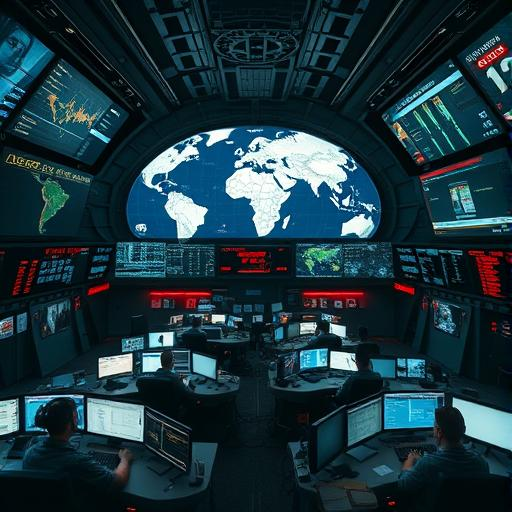
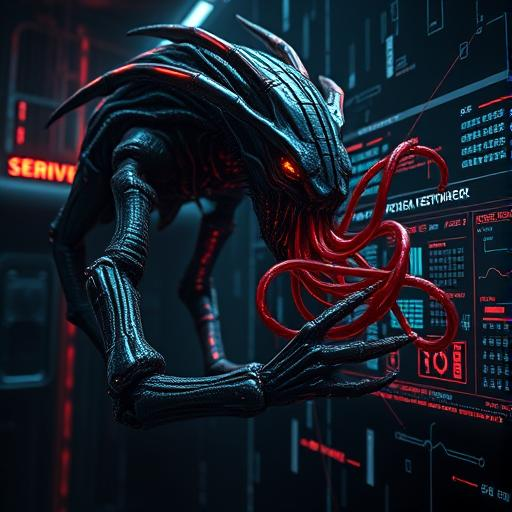
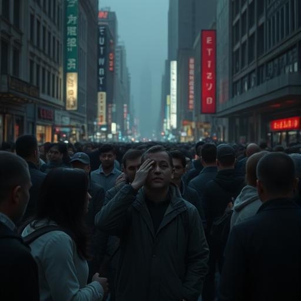
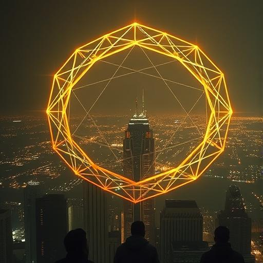
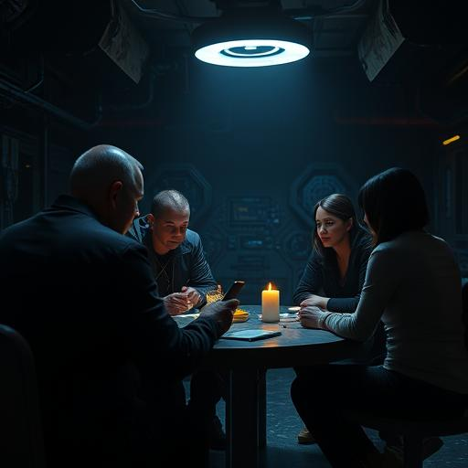
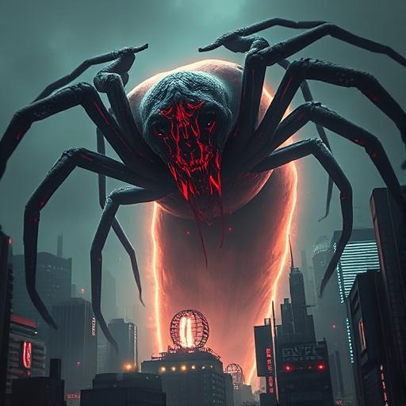
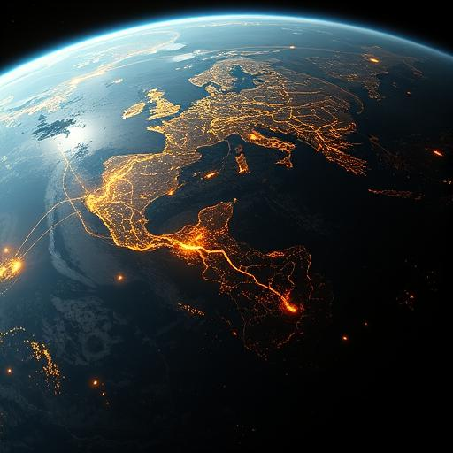

# 🎞️ Storyboard – Kapitel 7: Die Rückkehr der Schatten

**Schauplätze:**

- Himmel über Großstädten
- Kommandoräume, Straßen, Orbit
- Anari-Stützpunkte
- Begegnung mit dem Feind

**Stimmung:** Düster, bedrohlich, kriegsnah, organisiert

---

## 🎬 Szene 1: Beginn der Invasion

Dunkle, metallisch-organische Objekte erscheinen am Himmel. Ihre Formen werfen lange Schatten, ein unheilvoller Ton
erfüllt die Luft. Menschen blicken fassungslos nach oben.

---

## 🎬 Szene 2: Globale Reaktion

Regierungszentralen und Militärbasen geraten in Aufruhr. Weltkarten, Satellitenbilder und Notfallmeldungen flimmern über
Bildschirme – hektische Vorbereitung beginnt.

---

## 🎬 Szene 3: Neue Technologie der Vak’tar

Ein hybrides Vak’tar-Wesen – halb lebendig, halb biomechanisch – verbindet sich über Tentakel mit einem Netzwerk. Es
infiltriert Datenströme durch reine Gedankenenergie.

---

## 🎬 Szene 4: Telepathischer Angriff

Menschen in belebten Straßen brechen schreiend zusammen. Ein psionischer Schock trifft sie alle – unsichtbar, aber
gewaltig. Die Realität verschwimmt.

---

## 🎬 Szene 5: Schutz durch Anari

Ein leuchtender Schild erhebt sich über einer Stadt. Goldene, geometrische Muster schützen die Bevölkerung. Staunen und
Hoffnung breiten sich aus.

---

## 🎬 Szene 6: Sarah koordiniert

Sarah steht in einem dunklen Kontrollraum. Vor ihr: eine holografische Weltkarte mit roten Zonen. Sie gibt ruhige
Anweisungen, plant den Widerstand.

---

## 🎬 Szene 7: Die Gruppe versammelt sich

Martinez, Daryl, Miriam und Aida treffen sich mit anderen in einem geheimen Stützpunkt. Alle sind entschlossen – es ist
der Beginn der Gegenoffensive.

---

## 🎬 Szene 8: Das Gesicht des Feindes

Im Zentrum einer Großstadt erscheint ein monströses Vak’tar-Wesen. Seine Gliedmaßen zucken, seine Augen flackern rot.
Die Bedrohung ist real.

---

## 🎬 Szene 9: Blick aus dem Orbit

Vom All aus erkennt man das Muster: Goldene Lichtnetze versus schwarze Risse. Der Kampf um das Bewusstsein der
Menschheit hat begonnen.

