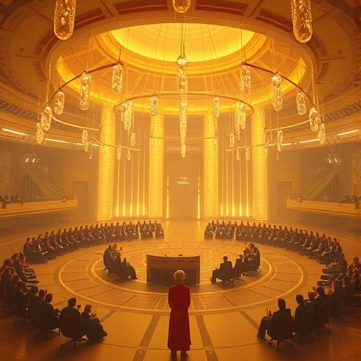
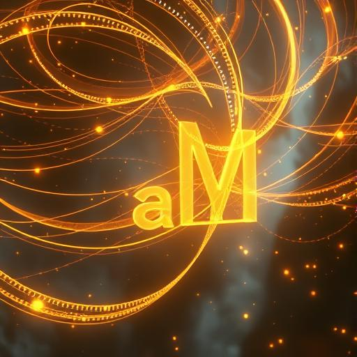
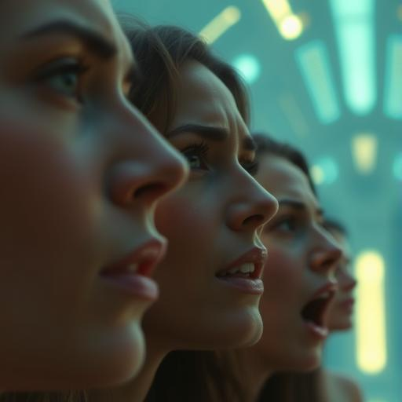
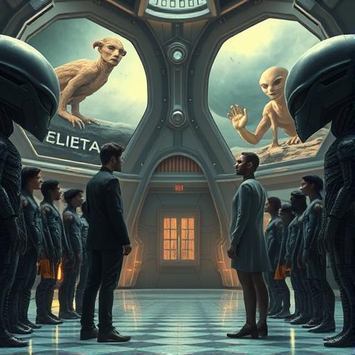
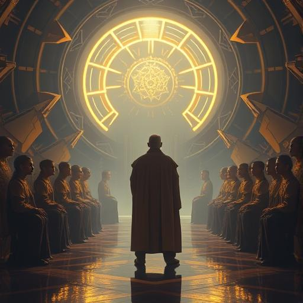
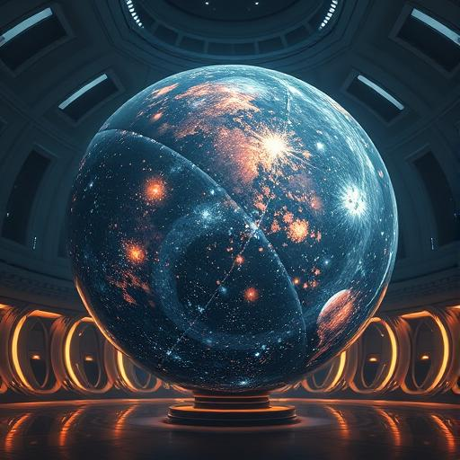
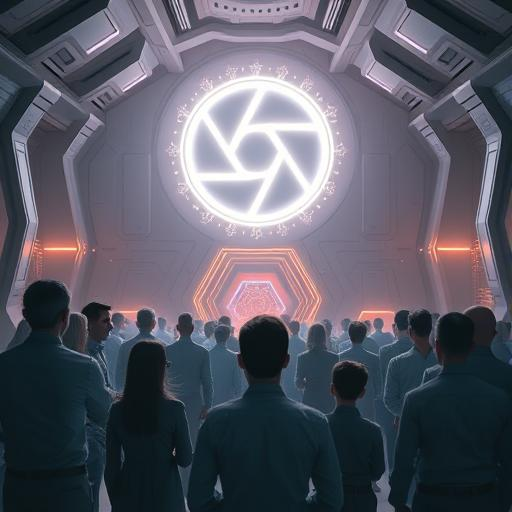
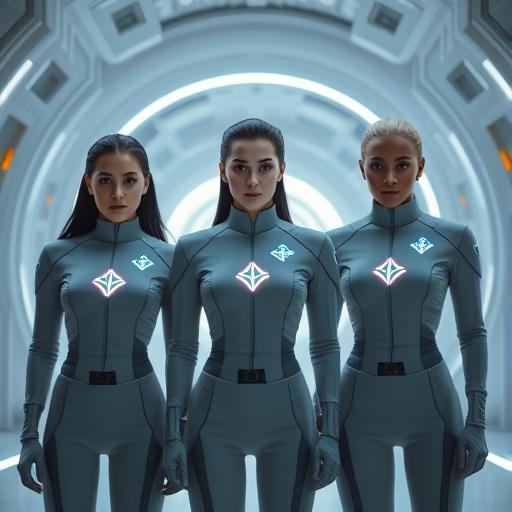
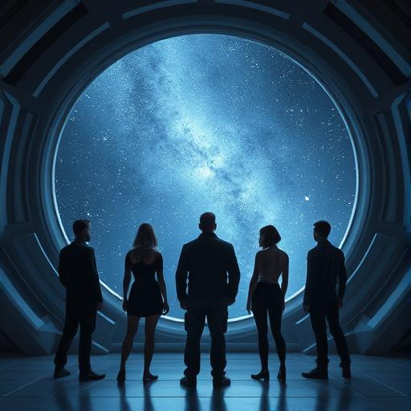

# 🎞️ Storyboard – Kapitel 8: Die Allianz

**Schauplätze:**  
- Anari-Versammlungshalle  
- Lichtkommunikation  
- Symbolische Räume der Verständigung  
- Blick in die Zukunft

**Stimmung:** Ehrfürchtig, diplomatisch, emotional, vorsichtig hoffnungsvoll

---

## 🎬 Szene 1: Beginn des Bündnisses

Eine riesige Halle, durchzogen von schwebenden Kristalllichtern. Menschen und Anari sitzen in konzentrischen Kreisen, umgeben von goldener Helligkeit – feierlich, gespannt.

---

## 🎬 Szene 2: Kommunikation durch Licht

Goldene Lichtbahnen formen sich zu schwebenden Sätzen. Vor den Menschen erscheinen Hologramme, die diese Sprache simultan übersetzen – ein Dialog zwischen Welten.

---

## 🎬 Szene 3: Emotionale Reaktion

Gesichter voller Tränen, Staunen, Ehrfurcht. Die Begegnung mit den Anari berührt die Seelen der Anwesenden – still, bewegend.

---

## 🎬 Szene 4: Zweifel und Konflikt

Zwei Menschengruppen stehen sich gegenüber – Hoffnung gegen Misstrauen. Sie stehen getrennt unter leuchtenden Wandbildern außerirdischer Herkunft.

---

## 🎬 Szene 5: Martinez fragt nach der Wahrheit

Father Martinez spricht allein zur Versammlung. Seine Worte sind ruhig, ehrlich. Die Lichtfäden im Raum pulsieren, reagieren auf seine Aufrichtigkeit.

---

## 🎬 Szene 6: Das Archiv der Galaxie

Ein schwebender Kristall zeigt die Geschichte der Galaxie: Sterne, fremde Völker, verlorene Zivilisationen. Erinnerungen fluten den Raum – visuelle Geschichte.

---

## 🎬 Szene 7: Die Allianz wird besiegelt

Ein leuchtendes Symbol erscheint über allen Köpfen – einfach, elegant, kraftvoll. Es markiert den Beginn eines Pakts zwischen Menschheit und Anari.

---

## 🎬 Szene 8: Neue Uniformen

Sarah, Aida und Daryl tragen schlichte Uniformen mit einem leuchtenden Zeichen – Symbol für ihre neue Rolle im intergalaktischen Bündnis.

---

## 🎬 Szene 9: Der letzte Blick

Die Gruppe schaut durch ein riesiges Fenster hinaus in den Weltraum. Ihre Silhouetten vor den Sternen – still, entschlossen, vereint.

