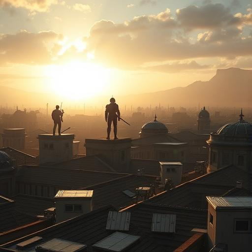
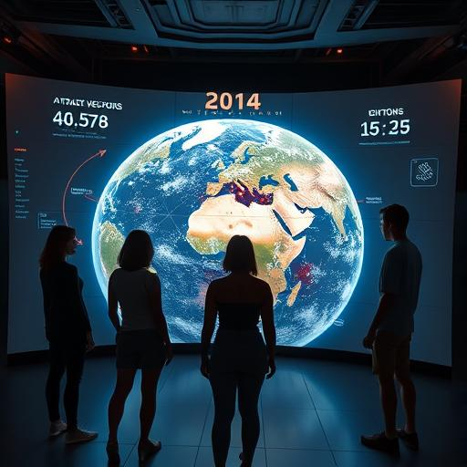
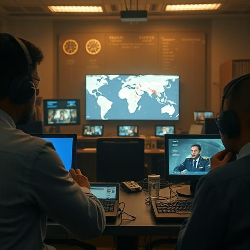
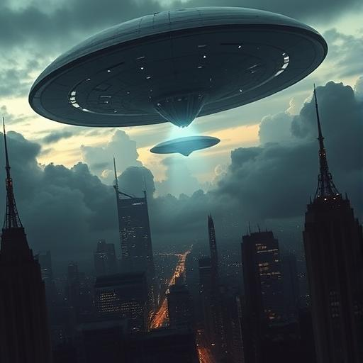
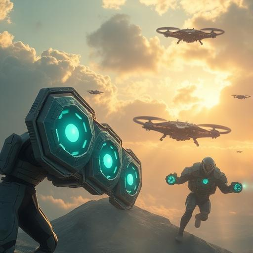
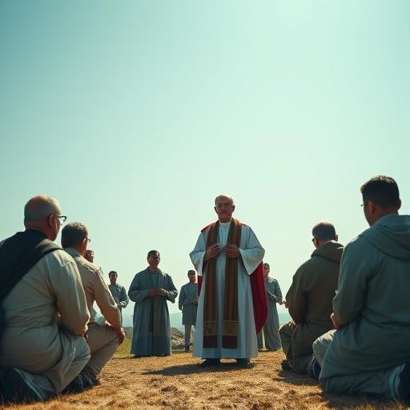
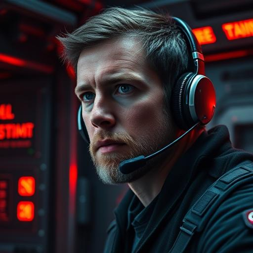
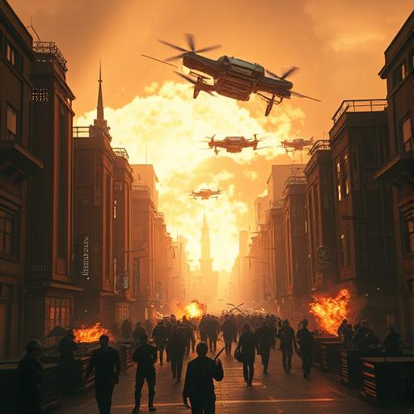
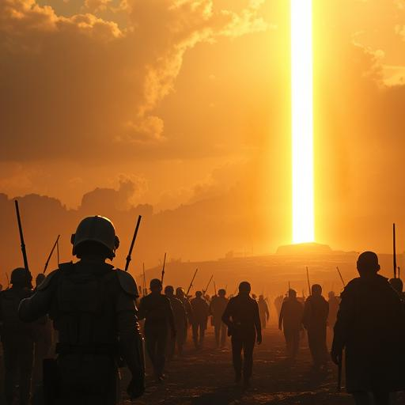

# 🎞️ Storyboard – Kapitel 9: Der letzte Tag

**Schauplätze:**

- Kommandozentralen
- Himmel über Großstädten
- Gebetsstätte, Schlachtfelder, virtueller Raum
- Übergang in eine neue Ära

**Stimmung:** Episch, ernst, emotional, weltumspannend

---

## 🎬 Szene 1: Morgendämmerung vor dem Angriff

Die Stadt liegt still im goldenen Morgenlicht der Anari. Martinez, Aida, Daryl und Sarah bereiten sich auf den finalen
Tag vor.

---

## 🎬 Szene 2: Strategiebesprechung

Die Gruppe versammelt sich um eine holografische Projektion der Erde. Zeitlinien, Angriffsachsen und Energiefelder sind
sichtbar – höchste Konzentration.

---

## 🎬 Szene 3: Weltweite Mobilisierung

In verschiedensten Ländern richten Menschen improvisierte Kontrollzentren ein. Auf Monitoren: Videoverbindungen,
Befehle, Hoffnung.

---

## 🎬 Szene 4: Ankunft der Vak’tar

Dunkle, fremdartige Schiffe durchbrechen die Wolkendecke. Ein unheilvoller Klang liegt in der Luft. Die Bedrohung ist
da.

---

## 🎬 Szene 5: Erste Verteidigungslinien

Schimmernde Schutzbarrieren und Anari-Drohnen werden aktiviert. Menschen bereiten sich mit neuer Technologie auf den
Kampf vor.

---

## 🎬 Szene 6: Gebet der Freiwilligen

Menschen aller Religionen versammeln sich zum Gebet. Ein Moment der Ruhe und Einheit vor dem Sturm. Martinez steht in
der Mitte.

---

## 🎬 Szene 7: Daryls letzter Funkspruch

Daryl spricht entschlossen in ein Headset. Hinter ihm flackern Warnlichter. Die Schlacht steht unmittelbar bevor.

---

## 🎬 Szene 8: Der Kampf beginnt

Explosionen erschüttern den Himmel. Anari, Menschen und Drohnen kämpfen vereint gegen die anstürmende Vak’tar-Macht.

---

## 🎬 Szene 9: Aidas virtueller Tunnel

Aida navigiert einen digitalen Raum. Datensymbole rauschen an ihr vorbei. Sie ist eins mit dem globalen Netz.

---

## 🎬 Szene 10: Das Ende beginnt

Ein gewaltiges goldenes Licht öffnet sich über der Erde. Die Schlacht erstarrt – Transformation, Hoffnung, ein neuer
Anfang beginnt.

